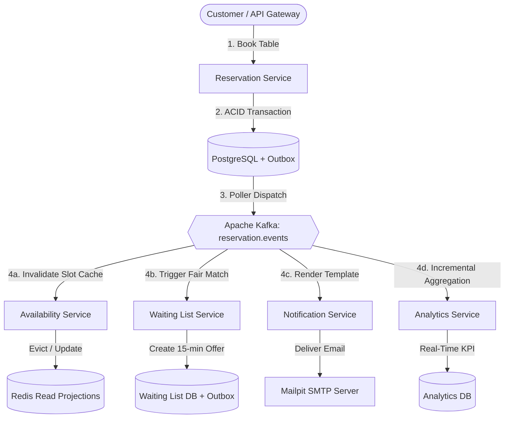

# 🍽️ Spring Boot Rube Goldberg Restaurant Reservation Platform

> A production-grade, event-driven microservices showcase built with **Java 26**, **Spring Boot 4.1.1**, **Spring Cloud 2024**, **Apache Kafka**, **Redis**, **PostgreSQL 17**, **Keycloak 26**, and **OpenTelemetry**.

[](https://openjdk.org/)
[](https://spring.io/projects/spring-boot)
[](https://spring.io/projects/spring-cloud)
[](https://kafka.apache.org/)
[](https://www.postgresql.org/)
[](https://redis.io/)
[](https://www.keycloak.org/)
[](https://opensource.org/licenses/MIT)

---

## 📖 Executive Summary & Domain Problem

The **Spring Boot Rube Goldberg Platform** is a distributed restaurant reservation system designed to solve high-concurrency dining logistics while showcasing modern, idiomatic Spring Boot and distributed systems engineering patterns.

### The Real-World Dilemma
1. **Extreme Concurrency & Double-Booking Risk**: Simultaneous booking requests for peak time slots must guarantee deterministic, atomic table allocation without race conditions.
2. **Dynamic Combinable Physical Inventory**: Tables can serve individuals or combine physically (e.g., Table 1 + Table 2) to accommodate larger parties.
3. **Sub-50ms Discovery vs. Authoritative Consistency**: Search operations must be blazingly fast (via Redis read projections) while booking mutations must be strictly consistent and ACID-compliant.
4. **Fair Demand Management**: When cancellations occur, freed slots must not trigger an unfair public "race condition"; instead, they must be offered fairly to the oldest matching candidate on a **FIFO Waiting List** with time-limited expirations.
5. **Decoupled Reliability**: Notifications and operational analytics must never degrade core reservation transaction latency or reliability.

### Why the "Rube Goldberg" Metaphor?
In engineering, a *Rube Goldberg machine* executes a complex chain reaction triggered by a single initial movement. In this platform, **a single customer event** (such as confirming or cancelling a reservation) triggers a choreographed, decoupled cascade across the ecosystem:



---

## 🏛️ Project Architecture & Structure

The repository is organized as a standard Maven Reactor multi-module project under `groupId: nl.invokedynamic.demo`, `artifactId: springboot.rubegoldberg`:

```
springboot_rube_goldberg/
├── common/
│   └── event-contracts/        # Shared domain event records (ReservationCreatedEvent, etc.)
├── gateway/                    # Spring Cloud Gateway (Port 8080) with Rate Limiting & Web UI
├── services/
│   ├── customer-service/       # Customer Profiles & Keycloak identity mapping (Port 8082)
│   ├── restaurant-service/     # Establishments, opening hours & table combinations (Port 8083)
│   ├── availability-service/   # CQRS read projections & Redis caching (Port 8084)
│   ├── reservation-service/    # Authoritative table allocator & transactional outbox (Port 8085)
│   ├── waiting-list-service/   # Fair FIFO waitlist & cascading offer matchmaker (Port 8086)
│   ├── analytics-service/      # Asynchronous KPI & conversion rate metrics (Port 8087)
│   └── notification-service/   # Mailpit email notifications & 24h reminder scheduler (Port 8088)
├── ui/                         # Lightweight browser portals (Customer & Manager)
├── infrastructure/             # Docker Compose, Keycloak, Prometheus, Grafana, OpenSearch configs
└── k8s/                        # Production Kubernetes manifests and Kustomize overlays
```

---

## 🔌 Microservices Matrix & Port Reference

Every microservice exposes **OpenAPI / Swagger UI**, **Micrometer Metrics**, and **Spring Boot Actuator Probes**:

| Service | Port | Database | Swagger UI URL | Health Endpoint |
| :--- | :--- | :--- | :--- | :--- |
| **API Gateway** | `8080` | Redis (Caching) | [Gateway UI](http://localhost:8080/ui/customer/index.html) | `http://localhost:8080/actuator/health` |
| **Customer Service** | `8082` | `customer_db` | [Customer Swagger UI](http://localhost:8082/swagger-ui.html) | `http://localhost:8082/actuator/health` |
| **Restaurant Service** | `8083` | `restaurant_db` | [Restaurant Swagger UI](http://localhost:8083/swagger-ui.html) | `http://localhost:8083/actuator/health` |
| **Availability Service** | `8084` | `availability_db` | [Availability Swagger UI](http://localhost:8084/swagger-ui.html) | `http://localhost:8084/actuator/health` |
| **Reservation Service** | `8085` | `reservation_db` | [Reservation Swagger UI](http://localhost:8085/swagger-ui.html) | `http://localhost:8085/actuator/health` |
| **Waiting List Service**| `8086` | `waiting_list_db` | [Waiting List Swagger UI](http://localhost:8086/swagger-ui.html) | `http://localhost:8086/actuator/health` |
| **Analytics Service** | `8087` | `analytics_db` | [Analytics Swagger UI](http://localhost:8087/swagger-ui.html) | `http://localhost:8087/actuator/health` |
| **Notification Service**| `8088` | `notification_db` | [Notification Swagger UI](http://localhost:8088/swagger-ui.html) | `http://localhost:8088/actuator/health` |

### Supporting Infrastructure Port Reference:
- **Keycloak OIDC**: `http://localhost:8081` (Admin: `admin` / `admin`)
- **Mailpit Web UI**: `http://localhost:8025` (SMTP: `localhost:1025`)
- **Grafana Dashboards**: `http://localhost:3000` (Admin: `admin` / `admin`)
- **Prometheus UI**: `http://localhost:9090`
- **OpenSearch Dashboards**: `http://localhost:5601`

---

## 📑 Interactive OpenAPI & Swagger UI Exploration

Each microservice automatically exposes a rich, interactive **Swagger UI** powered by `springdoc-openapi` and Spring Boot autoconfiguration.

### How OpenAPI is Generated
1. **Dependency Integration**: Each service includes `org.springdoc:springdoc-openapi-starter-webmvc-ui` (managed in root `pom.xml`).
2. **Declarative Annotations**:
   - Application classes are annotated with `@OpenAPIDefinition` to configure service metadata, titles, and descriptions.
   - Controllers are annotated with `@Tag`, `@Operation`, `@ApiResponse`, `@ApiResponses`, and `@Parameter` to document query parameters, request bodies, and response codes (`200`, `201`, `400`, `404`, `409`, `410`).
3. **Endpoint Exposure**:
   - **Interactive UI**: `http://localhost:<PORT>/swagger-ui.html` (e.g. `http://localhost:8085/swagger-ui.html` for Reservation Service).
   - **Raw OpenAPI 3.0 JSON Specification**: `http://localhost:<PORT>/v3/api-docs`

### How to Use Swagger UI for Manual Inspection:
1. Start the desired service (or the full stack with Docker Compose).
2. Open the service's Swagger UI in your browser (e.g. `http://localhost:8083/swagger-ui.html` for Restaurant Service).
3. Click on any endpoint (e.g., `POST /api/v1/restaurants`), click **"Try it out"**, fill in the example JSON payload, and click **"Execute"**.
4. You will receive live HTTP response status codes, response headers, and response bodies formatted as JSON or RFC 9457 Problem Details.

## 💡 Key Design Decisions & Technology Rationale

1. **Virtual Threads (Java 26 / Project Loom)**:
   - All services enable `spring.threads.virtual.enabled=true`, allowing high-throughput blocking database (JPA/JDBC) operations to scale without thread-pool exhaustion.
2. **Transactional Outbox Pattern**:
   - Core services (`reservation-service`, `restaurant-service`, `waiting-list-service`) write domain events directly to an `outbox_events` table inside the same local DB transaction as the business entity update. A background poller publishes them to Kafka with at-least-once guarantees, preventing distributed partial commits.
3. **Idempotent Consumers**:
   - Event consumers record processed `event_id` keys in a `processed_events` table to safely ignore duplicate Kafka deliveries.
4. **Deterministic Table Allocation Algorithm**:
   - Single tables are evaluated first (choosing the smallest table that accommodates the party size). If no single table suffices, configured table combinations are evaluated.
5. **RFC 9457 Problem Details**:
   - All REST APIs return standard `application/problem+json` error responses for bad requests, validation errors, and booking conflicts (`HTTP 409 Conflict`).

---

## 🚀 Running the Application

### Option A: Local Development (Docker Compose Infrastructure + Local Java Services)
This is the recommended workflow when developing or debugging individual microservices in your IDE:

1. **Start Supporting Infrastructure**:
   ```bash
   docker compose -f infrastructure/docker-compose.yml up -d
   ```
2. **Build and Test the Entire Reactor**:
   ```bash
   ./mvnw clean test
   ```
3. **Run Desired Service** (e.g. Reservation Service):
   ```bash
   ./mvnw spring-boot:run -pl services/reservation-service
   ```

---

### Option B: Full-Stack Docker Compose (Infrastructure + All Microservices)
Run the entire platform including all 8 microservices and frontend portals in Docker.

> [!IMPORTANT]
> The service Dockerfiles copy the pre-built Spring Boot executable JARs from each module's `target/` directory (e.g. `services/restaurant-service/target/restaurant-service-1.0.0-SNAPSHOT.jar`). Therefore, you **must package the Maven artifacts first** before invoking `docker compose` to build the container images:

1. **Package All Microservices (Build Executable JARs)**:
   ```bash
   ./mvnw clean package -DskipTests
   ```
   *(Or `./mvnw clean package` to run all unit and slice tests during the packaging).*

2. **Build Container Images and Start Full Stack**:
   ```bash
   docker compose -f infrastructure/docker-compose.yml -f infrastructure/docker-compose.apps.yml up --build -d
   ```

3. **Check Running Containers**:
   ```bash
   docker compose -f infrastructure/docker-compose.yml -f infrastructure/docker-compose.apps.yml ps
   ```

4. **Stop Full Stack**:
   ```bash
   docker compose -f infrastructure/docker-compose.yml -f infrastructure/docker-compose.apps.yml down
   ```

---

### Option C: Kubernetes (k8s) Deployment
The repository includes standard Kubernetes manifests with ConfigMaps, Secrets, Deployments, ClusterIP Services, and Actuator Liveness/Readiness probes:

1. **Deploy to Minikube, Kind, or a Remote Kubernetes Cluster**:
   ```bash
   kubectl apply -k k8s/
   ```
2. **Verify Pod Rollout**:
   ```bash
   kubectl get pods -n rube-goldberg -w
   ```
3. **Access API Gateway via Port-Forward**:
   ```bash
   kubectl port-forward svc/gateway -n rube-goldberg 8080:8080
   ```

---

## 🧪 Interactive End-to-End Walkthrough

Follow these steps via `curl` to experience the full **Rube Goldberg Event Chain Reaction**:

### Step 1: Register a Restaurant & Tables
```bash
# 1. Create Restaurant
REST_ID=$(curl -s -X POST http://localhost:8080/api/v1/restaurants \
  -H "Content-Type: application/json" \
  -d '{
    "name": "The Gourmet Goldberg",
    "address": "100 Reactor Way, Amsterdam",
    "timezone": "Europe/Amsterdam",
    "defaultReservationDurationMinutes": 90,
    "cancellationWindowHours": 2
  }' | jq -r '.id')
echo "Created Restaurant ID: $REST_ID"

# 2. Add Table 1 (Capacity: 4)
curl -s -X POST http://localhost:8080/api/v1/restaurants/$REST_ID/tables \
  -H "Content-Type: application/json" \
  -d '{"tableNumber": "T1", "capacity": 4}' | jq .
```

### Step 2: Query Real-Time Availability (Redis Caching)
```bash
curl -s "http://localhost:8080/api/v1/availability?restaurantId=$REST_ID&date=2026-09-01&time=19:00:00&partySize=4" | jq .
```
*Expected: `isAvailable: true`*

### Step 3: Book the Table (Guaranteed Reservation)
```bash
RES_ID=$(curl -s -X POST http://localhost:8080/api/v1/reservations \
  -H "Content-Type: application/json" \
  -d "{
    \"restaurantId\": \"$REST_ID\",
    \"customerId\": \"11111111-1111-1111-1111-111111111111\",
    \"customerName\": \"Alice\",
    \"customerEmail\": \"alice@example.com\",
    \"partySize\": 4,
    \"startTime\": \"2026-09-01T17:00:00Z\"
  }" | jq -r '.id')
echo "Confirmed Reservation: $RES_ID"
```
*Observe: Outbox publishes `ReservationCreatedEvent` → Notification service renders email → Check Mailpit at `http://localhost:8025`!*

### Step 4: Check Availability Again (Cache Invalidation)
```bash
curl -s "http://localhost:8080/api/v1/availability?restaurantId=$REST_ID&date=2026-09-01&time=19:00:00&partySize=4" | jq .
```
*Expected: `isAvailable: false` (the only 4-top table is booked).*

### Step 5: Join the Fair FIFO Waiting List
```bash
WAIT_ID=$(curl -s -X POST http://localhost:8080/api/v1/waiting-list \
  -H "Content-Type: application/json" \
  -d "{
    \"restaurantId\": \"$REST_ID\",
    \"customerId\": \"22222222-2222-2222-2222-222222222222\",
    \"customerEmail\": \"bob@example.com\",
    \"targetDate\": \"2026-09-01\",
    \"earliestTime\": \"18:00:00\",
    \"latestTime\": \"21:00:00\",
    \"partySize\": 4
  }" | jq -r '.id')
echo "Joined Waiting List: $WAIT_ID"
```

### Step 6: Trigger the Cancellation Chain Reaction
```bash
curl -s -X DELETE "http://localhost:8080/api/v1/reservations/$RES_ID?cancellationWindowHours=2&reason=Change%20of%20plans" | jq .
```
*The Goldberg Cascade in Motion:*
1. `reservation-service` marks reservation `CANCELLED`, releases Table T1, and emits `ReservationCancelledEvent`.
2. `waiting-list-service` receives the cancellation event, matches Bob as the oldest candidate, and creates a 15-minute time-limited offer.
3. `notification-service` emails Bob via Mailpit with his exclusive claim link.
4. `availability-service` updates projections.
5. `analytics-service` records cancellation KPI.

### Step 7: Inspect Real-Time Business Analytics
```bash
curl -s "http://localhost:8080/api/v1/analytics/summary?restaurantId=$REST_ID" | jq .
```

---

## 🖥️ Web Portals

The application includes lightweight, interactive responsive web interfaces served via the API Gateway:
- **Customer Portal**: `http://localhost:8080/ui/customer/index.html` (Check availability, book tables, join waiting list)
- **Manager Portal**: `http://localhost:8080/ui/manager/index.html` (Real-time live operational analytics)

---

## 🔐 Keycloak Security Configuration

The realm export file is pre-configured at `infrastructure/keycloak/realm-export.json`:
- **Realm**: `rube-goldberg`
- **Client**: `rube-goldberg-app`
- **Pre-seeded Users**:
  - `customer1` / `password` (Role: `CUSTOMER`)
  - `manager1` / `password` (Role: `RESTAURANT_MANAGER`)
  - `admin1` / `password` (Role: `ADMIN`)

---

## 📊 Observability & Telemetry

- **Prometheus Metrics**: Scraped from Spring Boot `/actuator/prometheus` via OpenTelemetry Collector.
- **Alertmanager Rules**: Defined in `infrastructure/prometheus/alert-rules.yml` for automated error rate and downtime alerts.
- **Grafana Platform Dashboard**: Pre-configured JSON dashboard in `infrastructure/grafana/dashboards/rube-goldberg-dashboard.json`.
