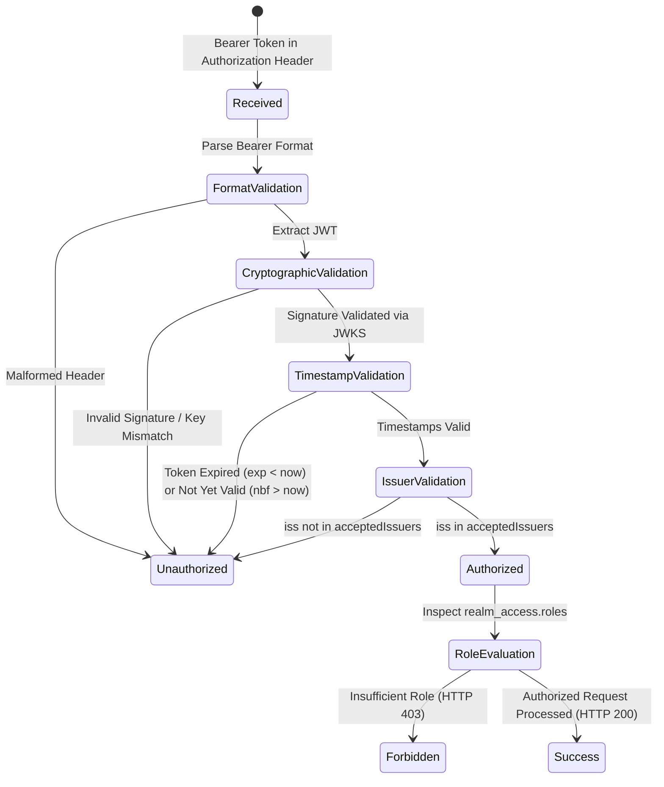

# Data Model: JWT Claims & Issuer Configuration

**Feature**: `006-fix-jwt-issuer-validation` | **Date**: 2026-09-14

## 1. Security Token Entity (`AuthenticationToken`)

A signed JSON Web Token (JWT) issued by Keycloak OpenID Connect endpoint.

| Field | Type | Required | Description | Example |
|---|---|---|---|---|
| `iss` | String (URI) | Yes | Issuer identifier. Must match an entry in `acceptedIssuers`. | `http://localhost:8081/realms/rube-goldberg` |
| `sub` | UUID String | Yes | Subject identifier of the authenticated user. | `b1fe71ae-5c3b-4e81-8b28-8a8fc5047237` |
| `preferred_username` | String | Yes | Unique login username. | `manager1` |
| `email` | String | No | User email address. | `manager1@example.com` |
| `realm_access.roles` | List<String> | Yes | Realm roles assigned to the user. | `["RESTAURANT_MANAGER"]` |
| `exp` | Long (Epoch s) | Yes | Expiration timestamp. | `1789375955` |
| `iat` | Long (Epoch s) | Yes | Issued-at timestamp. | `1789375655` |
| `typ` | String | Yes | Token type. | `Bearer` |
| `azp` | String | Yes | Authorized party (client ID). | `rube-goldberg-app` |

---

## 2. Issuer Configuration Model (`IssuerProperties`)

Configuration defining acceptable issuers and connection endpoints per deployment environment.

| Property | Type | Default Value | Docker Override | Purpose |
|---|---|---|---|---|
| `spring.security.oauth2.resourceserver.jwt.issuer-uri` | String (URI) | `http://localhost:8081/realms/rube-goldberg` | `http://keycloak:8080/realms/rube-goldberg` | Location for OIDC discovery & JWKS key fetching. |
| `security.jwt.accepted-issuers` | List<String> | `["http://localhost:8081/realms/rube-goldberg", "http://keycloak:8080/realms/rube-goldberg"]` | Same | Permitted values for the `iss` claim in incoming JWTs. |

---

## 3. Token Validation Lifecycle

