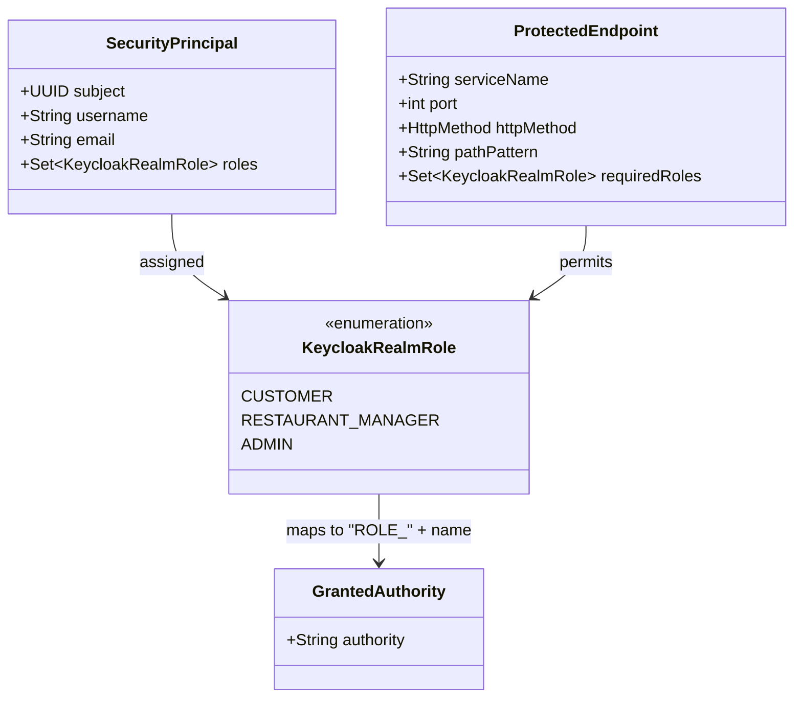

# Data Model: Role-Based Access Control (RBAC) & Endpoint Authorization

**Feature**: `007-role-endpoint-access`  
**Date**: 2026-09-14  

---

## 1. Conceptual Security Entities



### Entity: `KeycloakRealmRole`
- **Description**: Security role defined in the Keycloak realm `rube-goldberg` and embedded in the `realm_access.roles` JWT claim.
- **Values**:
  - `CUSTOMER`: Dining customer initiating personal reservations, joining waitlists, accepting offers, managing profile.
  - `RESTAURANT_MANAGER`: Restaurant operator configuring inventory, schedules, inspecting restaurant-wide reservations, and viewing analytics.
  - `ADMIN`: Platform administrator with full management access across restaurants and analytics.

### Entity: `SecurityPrincipal`
- **Description**: The authenticated caller represented inside Spring Security's `SecurityContextHolder`.
- **Attributes**:
  - `subject` (UUID / String): Extracted from JWT `sub` claim.
  - `username` (String): Extracted from JWT `preferred_username` claim (e.g. `customer1`, `manager1`, `admin1`).
  - `email` (String): Extracted from JWT `email` claim.
  - `authorities` (Set of `GrantedAuthority`): Spring Security granted authorities prefixed with `ROLE_` (e.g., `ROLE_CUSTOMER`, `ROLE_RESTAURANT_MANAGER`, `ROLE_ADMIN`).

### Entity: `KeycloakRealmRoleConverter`
- **Description**: Spring `Converter<Jwt, Collection<GrantedAuthority>>` converting incoming Nimbus `Jwt` tokens into a collection of `GrantedAuthority` instances.
- **Conversion Rule**:
  ```text
  jwt.claims["realm_access"]["roles"] -> [ "CUSTOMER" ] => [ GrantedAuthority("ROLE_CUSTOMER") ]
  ```
  Also appends any default scope claims if present.

---

## 2. Role-to-Endpoint Authority Matrix

| Service | Port | Endpoint Path | Method | Minimum Required Role(s) | Unauthenticated | Unauthorized Role |
|---|---|---|---|---|---|---|
| **restaurant-service** | 8083 | `/api/v1/restaurants` | POST | `RESTAURANT_MANAGER`, `ADMIN` | 401 Unauthorized | 403 Forbidden |
| | | `/api/v1/restaurants/{id}/tables` | POST | `RESTAURANT_MANAGER`, `ADMIN` | 401 Unauthorized | 403 Forbidden |
| | | `/api/v1/restaurants/{id}/table-combinations` | POST | `RESTAURANT_MANAGER`, `ADMIN` | 401 Unauthorized | 403 Forbidden |
| | | `/api/v1/restaurants/{id}/opening-hours` | PUT | `RESTAURANT_MANAGER`, `ADMIN` | 401 Unauthorized | 403 Forbidden |
| | | `/api/v1/restaurants/**` | GET | `CUSTOMER`, `RESTAURANT_MANAGER`, `ADMIN` | 401 Unauthorized | 403 Forbidden |
| **reservation-service** | 8085 | `/api/v1/reservations` | POST | `CUSTOMER` | 401 Unauthorized | 403 Forbidden |
| | | `/api/v1/reservations/{id}` | GET | `CUSTOMER`, `RESTAURANT_MANAGER`, `ADMIN` | 401 Unauthorized | 403 Forbidden |
| | | `/api/v1/reservations/{id}` | DELETE | `CUSTOMER`, `RESTAURANT_MANAGER`, `ADMIN` | 401 Unauthorized | 403 Forbidden |
| | | `/api/v1/reservations` | GET | `RESTAURANT_MANAGER`, `ADMIN` | 401 Unauthorized | 403 Forbidden |
| | | `/api/v1/reservations/{id}/status` | PATCH | `RESTAURANT_MANAGER`, `ADMIN` | 401 Unauthorized | 403 Forbidden |
| **waiting-list-service**| 8086 | `/api/v1/waiting-list` | POST | `CUSTOMER` | 401 Unauthorized | 403 Forbidden |
| | | `/api/v1/waiting-list/offers/{id}/accept` | POST | `CUSTOMER` | 401 Unauthorized | 403 Forbidden |
| **customer-service** | 8082 | `/api/v1/customers/**` | GET, PUT | `CUSTOMER` | 401 Unauthorized | 403 Forbidden |
| **availability-service**| 8084 | `/api/v1/availability` | GET | `CUSTOMER`, `RESTAURANT_MANAGER`, `ADMIN` | 401 Unauthorized | 403 Forbidden |
| **analytics-service** | 8087 | `/api/v1/analytics/**` | GET | `RESTAURANT_MANAGER`, `ADMIN` | 401 Unauthorized | 403 Forbidden |
| **All Services** | Any | `/swagger-ui/**`, `/v3/api-docs/**` | GET | None (`permitAll`) | 200 OK | N/A |

---

## 3. State & Lifecycle Rules

1. **Pre-Authentication (401 Unauthorized)**:
   - Request has no `Authorization: Bearer <token>` header, or token signature / issuer / expiration check fails.
   - Response: `401 Unauthorized` with `WWW-Authenticate: Bearer error="invalid_token"`.
2. **Post-Authentication, Forbidden Role (403 Forbidden)**:
   - Request has a valid signature and trusted issuer, but user does not hold any of the required `ROLE_*` authorities for the endpoint.
   - Response: `403 Forbidden`.
3. **Authorized (200 / 201 / 204)**:
   - Caller possesses at least one matching `ROLE_*` authority required by the filter chain rule.
   - Request executes controller business logic normally.
