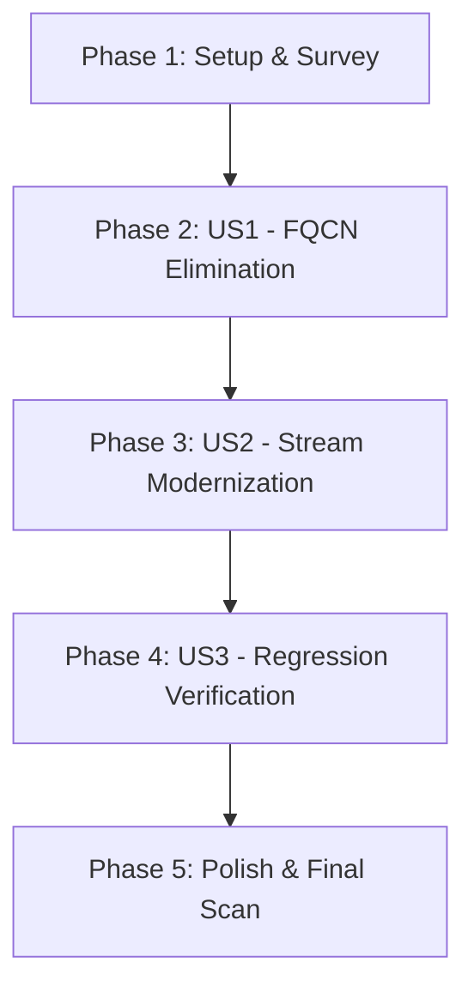

# Implementation Tasks: Code Style Refactoring - FQCN Elimination and Stream API Modernization

**Feature**: `009-clean-code-style` | **Date**: 2026-09-15 | **Spec**: [spec.md](spec.md) | **Plan**: [plan.md](plan.md)

## Phase 1: Setup & Codebase Survey

**Purpose**: Establish baseline verification commands and survey all module source trees for inline FQCNs and candidate loop constructs.

- [x] T001 [P] Perform static inspection scan across `services/`, `gateway/`, and `common/` documenting all inline FQCN and imperative loop candidates

---

## Phase 2: User Story 1 - Eliminate Inline Fully Qualified Class Names in Favor of Imports (Priority: P1) 🎯 MVP

**Goal**: Replace all inline fully qualified class names (`com.fasterxml.jackson.databind.JsonNode`, `java.util.List.of`, `java.util.Map.of`) in class bodies with simple class names and top-level `import` statements across event listeners and security tests.

**Independent Test**: Static ripgrep scan confirms zero occurrences of `com.fasterxml.jackson.databind.JsonNode`, `java.util.List.of`, and `java.util.Map.of` in method bodies, and all services compile cleanly (`./mvnw compile`).

### Implementation for User Story 1

- [x] T002 [P] [US1] Replace inline `com.fasterxml.jackson.databind.JsonNode` with imported `JsonNode` in `services/availability-service/src/main/java/nl/invokedynamic/demo/availability/events/AvailabilityEventListener.java`
- [x] T003 [P] [US1] Replace inline `com.fasterxml.jackson.databind.JsonNode` with imported `JsonNode` in `services/notification-service/src/main/java/nl/invokedynamic/demo/notification/events/NotificationEventListener.java`
- [x] T004 [P] [US1] Replace inline `com.fasterxml.jackson.databind.JsonNode` with imported `JsonNode` in `services/waiting-list-service/src/main/java/nl/invokedynamic/demo/waitinglist/events/ReservationCancelledListener.java`
- [x] T005 [P] [US1] Replace inline `com.fasterxml.jackson.databind.JsonNode` with imported `JsonNode` in `services/analytics-service/src/main/java/nl/invokedynamic/demo/analytics/events/AnalyticsEventListener.java`
- [x] T006 [P] [US1] Replace inline `java.util.List.of` and `java.util.Map.of` with imported `List.of` and `Map.of` in `services/restaurant-service/src/test/java/nl/invokedynamic/demo/restaurant/RestaurantSecurityTest.java`
- [x] T007 [P] [US1] Replace inline `java.util.List.of` and `java.util.Map.of` with imported `List.of` and `Map.of` in `services/reservation-service/src/test/java/nl/invokedynamic/demo/reservation/ReservationSecurityTest.java`
- [x] T008 [P] [US1] Replace inline `java.util.List.of` and `java.util.Map.of` with imported `List.of` and `Map.of` in `services/customer-service/src/test/java/nl/invokedynamic/demo/customer/CustomerSecurityTest.java`
- [x] T009 [P] [US1] Replace inline `java.util.List.of` and `java.util.Map.of` with imported `List.of` and `Map.of` in `services/availability-service/src/test/java/nl/invokedynamic/demo/availability/AvailabilitySecurityTest.java`
- [x] T010 [P] [US1] Replace inline `java.util.List.of` and `java.util.Map.of` with imported `List.of` and `Map.of` in `services/waiting-list-service/src/test/java/nl/invokedynamic/demo/waitinglist/WaitingListSecurityTest.java`
- [x] T011 [P] [US1] Replace inline `java.util.List.of` and `java.util.Map.of` with imported `List.of` and `Map.of` in `services/analytics-service/src/test/java/nl/invokedynamic/demo/analytics/AnalyticsSecurityTest.java`

**Checkpoint**: User Story 1 complete — all inline FQCNs removed with zero compilation errors.

---

## Phase 3: User Story 2 - Modernize Iteration and Filtering Logic Using Java Stream APIs (Priority: P1)

**Goal**: Refactor imperative loops with nested `if` structures and manual breaks into declarative Java Stream API pipelines (`map`, `filter`, `anyMatch`, `findFirst`, `flatMap`).

**Independent Test**: Unit and slice tests in `AvailabilityServiceUnitTest`, `WaitingListServiceUnitTest`, `ValidationExceptionHandler`, and `SecurityTest` continue to pass with 100% assertions satisfied.

### Implementation for User Story 2

- [x] T012 [P] [US2] Refactor table availability check and occupied table ID collection in `services/availability-service/src/main/java/nl/invokedynamic/demo/availability/service/AvailabilityService.java` to use Stream APIs (`map`, `collect(toSet())`, `anyMatch`, `noneMatch`)
- [x] T013 [P] [US2] Refactor FIFO candidate search loop in `services/waiting-list-service/src/main/java/nl/invokedynamic/demo/waitinglist/service/WaitingListService.java` to use Stream pipeline (`filter`, `findFirst`, `ifPresent`)
- [x] T014 [P] [US2] Refactor realm role conversion in `services/customer-service/src/main/java/nl/invokedynamic/demo/customer/config/KeycloakRealmRoleConverter.java` to Stream pipeline (`filter`, `map`, `forEach`)
- [x] T015 [P] [US2] Refactor realm role conversion in `services/restaurant-service/src/main/java/nl/invokedynamic/demo/restaurant/config/KeycloakRealmRoleConverter.java` to Stream pipeline (`filter`, `map`, `forEach`)
- [x] T016 [P] [US2] Refactor realm role conversion in `services/reservation-service/src/main/java/nl/invokedynamic/demo/reservation/config/KeycloakRealmRoleConverter.java` to Stream pipeline (`filter`, `map`, `forEach`)
- [x] T017 [P] [US2] Refactor realm role conversion in `services/availability-service/src/main/java/nl/invokedynamic/demo/availability/config/KeycloakRealmRoleConverter.java` to Stream pipeline (`filter`, `map`, `forEach`)
- [x] T018 [P] [US2] Refactor realm role conversion in `services/waiting-list-service/src/main/java/nl/invokedynamic/demo/waitinglist/config/KeycloakRealmRoleConverter.java` to Stream pipeline (`filter`, `map`, `forEach`)
- [x] T019 [P] [US2] Refactor realm role conversion in `services/analytics-service/src/main/java/nl/invokedynamic/demo/analytics/config/KeycloakRealmRoleConverter.java` to Stream pipeline (`filter`, `map`, `forEach`)
- [x] T020 [P] [US2] Refactor parameter validation error flattening in `services/restaurant-service/src/main/java/nl/invokedynamic/demo/restaurant/api/ValidationExceptionHandler.java` to use `flatMap` Stream pipeline
- [x] T021 [P] [US2] Refactor parameter validation error flattening in `services/reservation-service/src/main/java/nl/invokedynamic/demo/reservation/api/ValidationExceptionHandler.java` to use `flatMap` Stream pipeline
- [x] T022 [P] [US2] Refactor parameter validation error flattening in `services/customer-service/src/main/java/nl/invokedynamic/demo/customer/api/ValidationExceptionHandler.java` to use `flatMap` Stream pipeline
- [x] T023 [P] [US2] Refactor parameter validation error flattening in `services/availability-service/src/main/java/nl/invokedynamic/demo/availability/api/ValidationExceptionHandler.java` to use `flatMap` Stream pipeline
- [x] T024 [P] [US2] Refactor parameter validation error flattening in `services/waiting-list-service/src/main/java/nl/invokedynamic/demo/waitinglist/api/ValidationExceptionHandler.java` to use `flatMap` Stream pipeline
- [x] T025 [P] [US2] Refactor entity persistence loops to Stream mapping and `saveAll` batch operations in `services/availability-service/src/main/java/nl/invokedynamic/demo/availability/events/AvailabilityEventListener.java` and `services/reservation-service/src/main/java/nl/invokedynamic/demo/reservation/service/ReservationService.java`

**Checkpoint**: User Story 2 complete — all loops with nested conditionals replaced with idiomatic Streams.

---

## Phase 4: User Story 3 - Guarantee Behavioral Equivalence and Zero Functional Regressions (Priority: P1)

**Goal**: Validate that all refactorings maintain exact functional, algorithmic, and transactional equivalence across all services.

**Independent Test**: Complete Maven reactor test suite (`./mvnw clean test`) passes across all 10 modules with 0 failures and 0 errors.

### Implementation for User Story 3

- [x] T026 [US3] Verify preservation of sequential FIFO short-circuiting semantics in `RestaurantEventPublisher.java` and `ScheduledOutboxPoller.java`
- [x] T027 [US3] Execute full Maven reactor build and test suite (`./mvnw clean test`) across all 10 modules, verifying 100% pass rate

**Checkpoint**: Zero regressions confirmed.

---

## Phase 5: Polish & Documentation

**Purpose**: Final clean-up, static validation scan, and documentation consistency.

- [x] T028 Run static grep verification scan ensuring zero non-compliant FQCNs remain across the codebase
- [x] T029 Update README.md code style section if applicable

---

## Dependencies & Execution Order

### Parallel Opportunities

- **US1 (FQCNs)**: T002–T011 can all be executed in parallel across independent service and test files.
- **US2 (Streams)**:
  - T014–T019 (Keycloak converters) can be executed in parallel.
  - T020–T024 (Validation handlers) can be executed in parallel.
  - T012, T013, T025 can be executed concurrently.

---

## Implementation Strategy

- **MVP Scope**: User Story 1 (T002–T011) — cleanly imports all types and eliminates FQCNs in class bodies.
- **Incremental Delivery**: User Story 2 refactors business logic and error handlers service by service.
- **Verification Gate**: Phase 4 executes `./mvnw clean test` across all 10 modules to guarantee 0 regressions.
