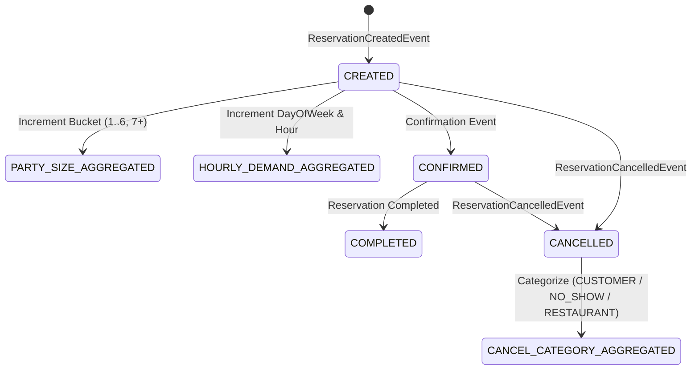

# Data Model: Automated Grafana Provisioning & Operational Analytics

**Feature**: `010-grafana-dashboard-analytics`  
**Date**: 2026-09-15  
**Spec**: [spec.md](./spec.md) | **Research**: [research.md](./research.md)

---

## 1. Metric Entities & Dimensional Models (Prometheus / Micrometer)

These dimensional models define the metrics emitted by `analytics-service` and scraped into Prometheus.

### 1.1 Visit Time Demand Aggregate (`reservation_demand_total`)
Tracks reservation demand distribution across service hours and days of the week.

- **Type**: Counter
- **Name**: `reservation_demand_total`
- **Labels / Dimensions**:
  - `restaurant_id`: UUID string (identifying the restaurant).
  - `day_of_week`: Enum (`MONDAY`, `TUESDAY`, `WEDNESDAY`, `THURSDAY`, `FRIDAY`, `SATURDAY`, `SUNDAY`).
  - `hour`: String formatted integer `00` through `23` (representing service hour of the reservation start time in local/UTC business time).
- **Cardinality**: Max 7 days × 24 hours = 168 series per restaurant.
- **PromQL Aggregation**:
  ```promql
  sum by (day_of_week, hour) (reservation_demand_total{restaurant_id=~"$restaurant_id"})
  ```

---

### 1.2 Party Size Distribution (`reservation_party_size_total`)
Tracks customer group size frequency across discrete seating capacity buckets.

- **Type**: Counter
- **Name**: `reservation_party_size_total`
- **Labels / Dimensions**:
  - `restaurant_id`: UUID string.
  - `party_bucket`: Discrete bucket string (`1`, `2`, `3`, `4`, `5`, `6`, `7+`).
- **Bucket Classification Logic**:
  - If `partySize <= 6`: `String.valueOf(partySize)`
  - If `partySize >= 7`: `"7+"`
- **Cardinality**: Exactly 7 series per restaurant.
- **PromQL Aggregation**:
  ```promql
  sum by (party_bucket) (reservation_party_size_total{restaurant_id=~"$restaurant_id"})
  ```

---

### 1.3 Cancellation Metric (`reservation_cancellations_total`)
Tracks cancellations categorized by trigger source and reason.

- **Type**: Counter
- **Name**: `reservation_cancellations_total`
- **Labels / Dimensions**:
  - `restaurant_id`: UUID string.
  - `category`: Enum string:
    - `CUSTOMER_REQUEST`: Customer-initiated cancellation prior to reservation time.
    - `NO_SHOW_LATE_CANCEL`: Customer failed to show up or cancelled past the late-cancellation cutoff.
    - `RESTAURANT_INITIATED`: Table inventory conflict, kitchen closure, or administrative void.
- **Cardinality**: Exactly 3 series per restaurant.
- **PromQL Aggregation**:
  ```promql
  sum by (category) (reservation_cancellations_total{restaurant_id=~"$restaurant_id"})
  ```
- **Overall Cancellation Rate Formula**:
  ```promql
  sum(reservation_cancellations_total{restaurant_id=~"$restaurant_id"})
  /
  sum(reservation_status_total{restaurant_id=~"$restaurant_id", status="CREATED"}) * 100
  ```

---

## 2. Persistent Domain Entities (PostgreSQL in `analytics-service`)

These entities persist historical operational analytics for long-term auditing and REST reporting.

### 2.1 `ReservationHourlyMetricsEntity`
Stores hourly booking counts per day for durable persistence.

```java
@Entity
@Table(name = "reservation_hourly_metrics")
public class ReservationHourlyMetricsEntity {
    @Id
    private UUID id;
    
    @Column(nullable = false)
    private UUID restaurantId;
    
    @Column(nullable = false)
    private LocalDate metricDate;
    
    @Column(nullable = false)
    private int hourOfDay; // 0..23
    
    @Column(nullable = false)
    private long reservationCount;
}
```

### 2.2 `ReservationDailyMetricsEntity` (Extensions)
Extended to track party size buckets and cancellation categories.

```java
@Entity
@Table(name = "reservation_daily_metrics")
public class ReservationDailyMetricsEntity {
    @Id
    private UUID id;
    private UUID restaurantId;
    private LocalDate metricDate;
    
    // Existing counts
    private long reservationsCreatedCount = 0;
    private long reservationsCompletedCount = 0;
    private long reservationsCancelledCount = 0;
    private long reservationsNoShowCount = 0;
    private long totalGuestsCount = 0;

    // Granular Party Size Buckets
    private long partySize1Count = 0;
    private long partySize2Count = 0;
    private long partySize3Count = 0;
    private long partySize4Count = 0;
    private long partySize5Count = 0;
    private long partySize6Count = 0;
    private long partySize7PlusCount = 0;

    // Cancellation Breakdown
    private long cancelledCustomerRequestCount = 0;
    private long cancelledNoShowCount = 0;
    private long cancelledRestaurantInitiatedCount = 0;
}
```

---

## 3. Provisioning Configuration Entities

### 3.1 Datasource Definition (`infrastructure/grafana/provisioning/datasources/prometheus.yml`)
```yaml
apiVersion: 1
datasources:
  - name: Prometheus
    type: prometheus
    access: proxy
    url: http://prometheus:9090
    isDefault: true
    editable: true
```

### 3.2 Dashboard Provider Definition (`infrastructure/grafana/provisioning/dashboards/dashboards.yml`)
```yaml
apiVersion: 1
providers:
  - name: 'Platform Dashboards'
    orgId: 1
    folder: ''
    type: file
    disableDeletion: false
    updateIntervalSeconds: 10
    allowUiUpdates: true
    options:
      path: /var/lib/grafana/dashboards
```

---

## 4. State Transitions & Lifecycle


