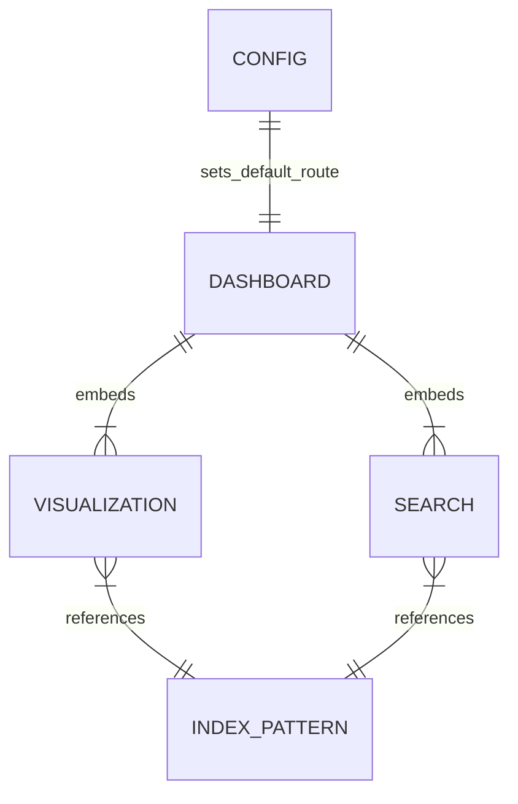

# Data Model: OpenSearch Dashboards Saved Objects

**Feature**: `012-opensearch-dashboard-provisioning`  
**Date**: 2026-09-15  
**Spec Reference**: [spec.md](./spec.md)

---

## 1. Saved Objects Entity Architecture

OpenSearch Dashboards persists metadata (Index Patterns, Visualizations, Searches, Dashboards, and UI Configuration) as **Saved Objects**. These objects are serialized as Newline Delimited JSON (`.ndjson`) records with typed attributes and cross-entity references.



---

## 2. Saved Object Schemas

### 2.1 Index Patterns (`type: index-pattern`)

Defines how OpenSearch Dashboards maps and searches underlying OpenSearch indices and data streams.

| Object ID | Title Pattern | Time Field | Searchable Core Fields |
|---|---|---|---|
| `otel-logs` | `otel-logs*` | `timestamp` | `timestamp`, `serviceName`, `severity`, `traceId`, `spanId`, `message`, `logger`, `thread` |
| `ss4o_traces` | `ss4o_traces-*` | `startTime` | `startTime`, `endTime`, `serviceName`, `name`, `durationInNanos`, `statusCode`, `traceId`, `spanId`, `parentSpanId` |

**Attributes Schema**:
```json
{
  "id": "otel-logs",
  "type": "index-pattern",
  "attributes": {
    "title": "otel-logs*",
    "timeFieldName": "timestamp"
  }
}
```

---

### 2.2 Visualizations (`type: visualization`)

Individual chart widgets displaying metric aggregations bound to an index pattern.

| Object ID | Title | Visualization Type | Aggregation / Metrics |
|---|---|---|---|
| `vis-logs-volume` | Log Event Volume | Vertical Bar Chart | Count over date histogram (`timestamp`) |
| `vis-logs-severity` | Severity Breakdown | Donut Chart | Terms aggregation on `severity.keyword` |
| `vis-logs-service` | Logs by Service | Horizontal Bar Chart | Terms aggregation on `serviceName.keyword` |
| `vis-traces-throughput` | Trace Span Throughput | Line / Area Chart | Count over date histogram (`startTime`) |
| `vis-traces-latency` | Span Duration (ms) | Histogram | Average/Percentile of `durationInNanos` |
| `vis-traces-status` | Trace Status (OK vs ERROR) | Donut Chart | Terms aggregation on `statusCode.keyword` |

---

### 2.3 Saved Searches (`type: search`)

Structured tabular data views pre-configured with visible columns and default sort order.

| Object ID | Title | Index Pattern | Visible Columns | Sort Order |
|---|---|---|---|---|
| `search-logs-stream` | Application Log Stream | `otel-logs` | `timestamp`, `serviceName`, `severity`, `traceId`, `message` | `timestamp: desc` |
| `search-traces-stream` | Distributed Trace Spans | `ss4o_traces` | `startTime`, `serviceName`, `name`, `durationInNanos`, `statusCode`, `traceId` | `startTime: desc` |

---

### 2.4 Dashboards (`type: dashboard`)

Aggregated presentation screens composed of multiple visualization panels and saved searches with responsive grid layouts (`gridData`).

#### 1. Platform Observability Overview (`id: platform-observability-overview`)
- **Title**: `Platform Observability Overview`
- **Panels**:
  - Top: Log Volume Over Time (`vis-logs-volume`) and Trace Throughput (`vis-traces-throughput`).
  - Middle: Severity Breakdown (`vis-logs-severity`) and Trace Status (`vis-traces-status`).
  - Bottom: High-level Logs by Service (`vis-logs-service`).

#### 2. Application Logs Dashboard (`id: application-logs-dashboard`)
- **Title**: `Application Logs Dashboard`
- **Panels**:
  - Top Left: Log Event Volume histogram (`vis-logs-volume`).
  - Top Right: Severity Breakdown donut (`vis-logs-severity`).
  - Middle: Log Volume by Service horizontal bars (`vis-logs-service`).
  - Bottom: Interactive Application Log Stream search table (`search-logs-stream`).

#### 3. Distributed Traces Dashboard (`id: distributed-traces-dashboard`)
- **Title**: `Distributed Traces Dashboard`
- **Panels**:
  - Top Left: Trace Span Throughput timeline (`vis-traces-throughput`).
  - Top Right: Trace Status distribution (`vis-traces-status`).
  - Middle: Operation Duration / Latency histogram (`vis-traces-latency`).
  - Bottom: Recent Distributed Trace Spans table (`search-traces-stream`).

---

### 2.5 Global UI Configuration (`type: config`)

Configures default global settings in OpenSearch Dashboards:

```json
{
  "id": "2.19.0",
  "type": "config",
  "attributes": {
    "defaultRoute": "/app/dashboards#/view/application-logs-dashboard",
    "timepicker:timeDefaults": "{\"from\":\"now-15m\",\"to\":\"now\"}",
    "timepicker:refreshIntervalDefaults": "{\"pause\":false,\"value\":10000}"
  }
}
```

---

## 3. Serialization Schema in `dashboards.ndjson`

Each line in `infrastructure/opensearch-dashboards/dashboards.ndjson` is an independent, valid JSON record:

```text
{"id":"otel-logs","type":"index-pattern","attributes":{"title":"otel-logs*","timeFieldName":"timestamp"}}
{"id":"ss4o_traces","type":"index-pattern","attributes":{"title":"ss4o_traces-*","timeFieldName":"startTime"}}
{"id":"vis-logs-volume","type":"visualization",...}
{"id":"application-logs-dashboard","type":"dashboard",...}
{"id":"2.19.0","type":"config",...}
```
