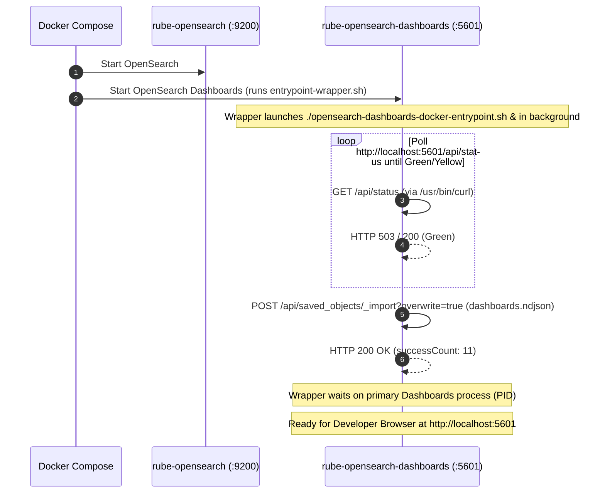

# Implementation Plan: OpenSearch Dashboards Provisioning

**Branch**: `012-opensearch-dashboard-provisioning` | **Date**: 2026-09-15 | **Spec**: [spec.md](./spec.md)

**Input**: Feature specification from `specs/012-opensearch-dashboard-provisioning/spec.md`

---

## Summary

Automatically provision OpenSearch Dashboards upon Docker Compose startup with pre-configured index patterns (`otel-logs*`, `ss4o_traces-*`), visualizations, and three production-ready dashboards:
1. **Platform Observability Overview**: High-level platform health, log rates, and trace throughput.
2. **Application Logs Dashboard**: Deep microservice log exploration, severity breakdowns, and interactive log table (configured as the default landing route).
3. **Distributed Traces Dashboard**: Latency percentiles, error breakdowns, and transaction span waterfall inspection.

Provisioning will be orchestrated via a volume-mounted entrypoint wrapper script (`infrastructure/opensearch-dashboards/entrypoint-wrapper.sh`) inside the existing `opensearch-dashboards` container, executing an idempotent import using the container's built-in `/usr/bin/curl` against the OpenSearch Dashboards Saved Objects API (`POST /api/saved_objects/_import?overwrite=true`). This requires zero extra containers in Docker Compose.

---

## Technical Context

**Language/Tools**: POSIX Shell (`sh`), `curl`, Newline Delimited JSON (`.ndjson`)  
**Primary Dependencies**: `opensearchproject/opensearch-dashboards:2.19.0` (with built-in `/usr/bin/curl`), Docker Compose  
**Storage**: OpenSearch Dashboards metadata index (`.kibana` / `.opensearch_dashboards`)  
**Testing**: Shell verification scripts, REST API assertions (`curl`), Docker Compose startup validation  
**Target Platform**: Docker Compose on macOS / Linux  
**Project Type**: Infrastructure automation & Observability UI provisioning  
**Performance Goals**: Provisioning execution completes in under 10 seconds once Dashboards is healthy  
**Constraints**: Zero code changes to Java microservices; zero extra containers in `docker-compose.yml`; 100% idempotent across container restarts (`?overwrite=true`)  
**Scale/Scope**: 11 saved objects (2 index patterns, 6 visualizations, 2 searches, 3 dashboards, 1 UI config)

---

## Constitution Check

*GATE: Must pass before Phase 0 research. Re-check after Phase 1 design.*

| Principle | Requirement | Status | Rationale |
|---|---|---|---|
| **I. Strict Specification Adherence** | Follow approved requirements and user clarifications | **PASS** | Provisions exactly 3 dashboards, sets Application Logs as default route, and pre-configures 15m window with 10s auto-refresh per ratified clarifications. |
| **II. Maven Reactor Architecture** | Preserve multi-module structure | **PASS** | Infrastructure-only feature; no module coupling or POM modifications required. |
| **III. Modern Spring Boot Feature Showcase** | Demonstrate idiomatic capabilities | **PASS** | Directly consumes standardized telemetry signals (OTLP logs, W3C traces) emitted by Spring Boot 4.1.1 microservices. |
| **IV. Agentic AI Traceability** | Predictable, deterministic changes | **PASS** | Provisioning assets are version-controlled in `infrastructure/opensearch-dashboards/` as plain text `.ndjson` and `.sh` files. |
| **V. Comprehensive Testing** | Automated quality gates | **PASS** | Verified via headless REST API contracts and Docker Compose health validation. |

---

## Project Structure

### Documentation (this feature)

```text
specs/012-opensearch-dashboard-provisioning/
├── plan.md              # This implementation plan
├── research.md          # Technical decisions & architecture research
├── data-model.md        # Saved objects data schemas and relationships
├── contracts/
│   └── dashboard-provisioning-contract.md # OpenSearch Dashboards REST API & wrapper contract
├── quickstart.md        # End-to-end validation scenarios
├── checklists/
│   ├── requirements.md  # Specification quality checklist
│   └── provisioning.md  # Infrastructure reliability checklist
└── tasks.md             # (Created by /speckit-tasks)
```

### Source Code Layout

```text
infrastructure/
├── docker-compose.yml   # Mount ./opensearch-dashboards and set entrypoint wrapper on opensearch-dashboards service
└── opensearch-dashboards/
    ├── dashboards.ndjson          # Saved objects export manifest (dashboards, vis, index-patterns, UI config)
    └── entrypoint-wrapper.sh      # Entrypoint wrapper: boots Dashboards, polls localhost:5601, imports ndjson
README.md                # Updated OpenSearch Dashboards user navigation documentation
```

---

## Implementation Architecture



---

## Validation Strategy

1. **Syntactic & Schema Validation**:
   - Verify `dashboards.ndjson` contains valid JSON per line and accurate references between dashboards, visualizations, searches, and index patterns.
2. **Container Startup & Provisioning Logs**:
   - Inspect `docker compose logs opensearch-dashboards` &rarr; verify wrapper script detects Dashboards readiness and reports `Import successful` with zero errors.
3. **API Import & Idempotency Verification**:
   - Validate `GET /api/saved_objects/_find?type=dashboard` returns exactly 3 dashboards.
   - Restart the container (`docker compose restart opensearch-dashboards`) &rarr; confirm re-import succeeds with zero duplicates.
4. **Browser UI Flow**:
   - Open `http://localhost:5601` &rarr; verify direct redirect to Application Logs Dashboard (`/app/dashboards#/view/application-logs-dashboard`) with 15-minute time window and 10-second auto-refresh.
