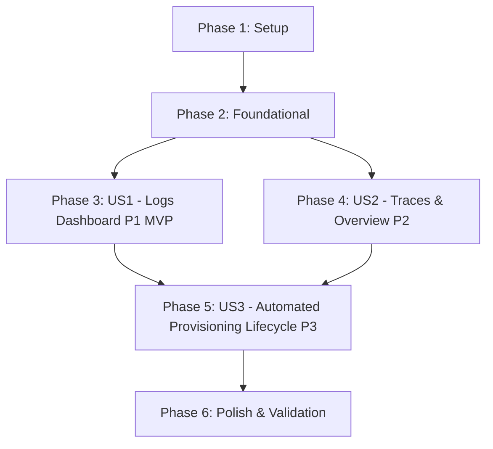

# Implementation Tasks: OpenSearch Dashboards Provisioning

**Feature**: `012-opensearch-dashboard-provisioning` | **Date**: 2026-09-16  
**Spec**: [spec.md](./spec.md) | **Plan**: [plan.md](./plan.md) | **Data Model**: [data-model.md](./data-model.md) | **Contracts**: [contracts/dashboard-provisioning-contract.md](./contracts/dashboard-provisioning-contract.md)

---

## Phase 1: Setup (Shared Infrastructure)

**Purpose**: Establish directory structure and base provisioning artifacts in the repository.

- [X] T001 Create directory `infrastructure/opensearch-dashboards/` for provisioning manifest and wrapper script
- [X] T002 [P] Initialize empty manifest file `infrastructure/opensearch-dashboards/dashboards.ndjson` for saved objects export lines

---

## Phase 2: Foundational (Blocking Prerequisites)

**Purpose**: Core infrastructure and base manifest definitions that all user stories depend on.

**⚠️ CRITICAL**: Must complete before user story implementation can proceed.

- [X] T003 Define base JSON schema template and NDJSON entry structure for OpenSearch Dashboards 2.19.0 saved objects in `infrastructure/opensearch-dashboards/dashboards.ndjson`
- [X] T004 [P] Create manifest validation script `infrastructure/opensearch-dashboards/validate-manifest.sh` to assert NDJSON line syntax, non-empty attributes, and valid type declarations

**Checkpoint**: Foundation ready - user story implementation can now begin.

---

## Phase 3: User Story 1 - Out-of-the-Box Application Logs Dashboard (Priority: P1) 🎯 MVP

**Goal**: Automatically configure the `otel-logs*` index pattern, log visualizations, log stream search table, and the dedicated "Application Logs Dashboard".

**Independent Test**: Import the log saved objects into OpenSearch Dashboards; verify that `otel-logs*` is registered with time field `timestamp`, and the "Application Logs Dashboard" displays log event volumes, severity breakdowns, logs by service, and structured log stream rows.

### Implementation for User Story 1

- [X] T005 [P] [US1] Define index pattern saved object for `otel-logs` in `infrastructure/opensearch-dashboards/dashboards.ndjson` with attributes `title: "otel-logs*"` and `timeFieldName: "timestamp"`
- [X] T006 [P] [US1] Define visualization saved object `vis-logs-volume` in `infrastructure/opensearch-dashboards/dashboards.ndjson` (Vertical Bar Chart date histogram on `timestamp` over `otel-logs*`)
- [X] T007 [P] [US1] Define visualization saved object `vis-logs-severity` in `infrastructure/opensearch-dashboards/dashboards.ndjson` (Donut Chart terms aggregation on `severity.keyword` over `otel-logs*`)
- [X] T008 [P] [US1] Define visualization saved object `vis-logs-service` in `infrastructure/opensearch-dashboards/dashboards.ndjson` (Horizontal Bar Chart terms aggregation on `serviceName.keyword` over `otel-logs*`)
- [X] T009 [US1] Define saved search object `search-logs-stream` in `infrastructure/opensearch-dashboards/dashboards.ndjson` referencing `otel-logs` with visible columns `["timestamp", "serviceName", "severity", "traceId", "message"]` sorted by `timestamp: desc`
- [X] T010 [US1] Assemble dashboard saved object `application-logs-dashboard` in `infrastructure/opensearch-dashboards/dashboards.ndjson` with title `"Application Logs Dashboard"`, embedding panels `vis-logs-volume`, `vis-logs-severity`, `vis-logs-service`, and `search-logs-stream` with responsive grid layouts

**Checkpoint**: User Story 1 log objects are fully assembled and can be imported and tested independently.

---

## Phase 4: User Story 2 - Out-of-the-Box Distributed Traces Dashboard & Visualization (Priority: P2)

**Goal**: Automatically configure the `ss4o_traces-*` index pattern, trace visualizations, trace spans search table, the dedicated "Distributed Traces Dashboard", and the unified "Platform Observability Overview" dashboard.

**Independent Test**: Import trace saved objects; verify that `ss4o_traces-*` is registered with time field `startTime`, "Distributed Traces Dashboard" displays span throughput, status distribution, and latency percentiles, and "Platform Observability Overview" combines both log and trace health metrics.

### Implementation for User Story 2

- [X] T011 [P] [US2] Define index pattern saved object for `ss4o_traces` in `infrastructure/opensearch-dashboards/dashboards.ndjson` with attributes `title: "ss4o_traces-*"` and `timeFieldName: "startTime"`
- [X] T012 [P] [US2] Define visualization saved object `vis-traces-throughput` in `infrastructure/opensearch-dashboards/dashboards.ndjson` (Line/Area Chart date histogram on `startTime` over `ss4o_traces-*`)
- [X] T013 [P] [US2] Define visualization saved object `vis-traces-status` in `infrastructure/opensearch-dashboards/dashboards.ndjson` (Donut Chart terms aggregation on `statusCode.keyword` over `ss4o_traces-*`)
- [X] T014 [P] [US2] Define visualization saved object `vis-traces-latency` in `infrastructure/opensearch-dashboards/dashboards.ndjson` (Histogram of `durationInNanos` over `ss4o_traces-*`)
- [X] T015 [US2] Define saved search object `search-traces-stream` in `infrastructure/opensearch-dashboards/dashboards.ndjson` referencing `ss4o_traces` with visible columns `["startTime", "serviceName", "name", "durationInNanos", "statusCode", "traceId"]` sorted by `startTime: desc`
- [X] T016 [US2] Assemble dashboard saved object `distributed-traces-dashboard` in `infrastructure/opensearch-dashboards/dashboards.ndjson` with title `"Distributed Traces Dashboard"`, embedding panels `vis-traces-throughput`, `vis-traces-status`, `vis-traces-latency`, and `search-traces-stream`
- [X] T017 [US2] Assemble overview dashboard saved object `platform-observability-overview` in `infrastructure/opensearch-dashboards/dashboards.ndjson` with title `"Platform Observability Overview"`, embedding combined panels `vis-logs-volume`, `vis-traces-throughput`, `vis-logs-severity`, `vis-traces-status`, and `vis-logs-service`

**Checkpoint**: User Stories 1 and 2 saved objects are completely defined and ready for automated provisioning.

---

## Phase 5: User Story 3 - Automated Provisioning Lifecycle & Zero-Touch Deployment (Priority: P3)

**Goal**: Implement the container-internal entrypoint wrapper script and configure Docker Compose volume mounting so that dashboards, index patterns, and default landing configurations are provisioned automatically and idempotently upon startup with zero extra containers.

**Independent Test**: Run `docker compose up -d` in `infrastructure/`; verify `opensearch-dashboards` container logs report healthy status detection and successful import of 11 saved objects; navigate to `http://localhost:5601` and verify automatic redirect to Application Logs Dashboard with a 15-minute time window and 10-second auto-refresh.

### Implementation for User Story 3

- [X] T018 [US3] Add global UI configuration saved object `2.19.0` in `infrastructure/opensearch-dashboards/dashboards.ndjson` setting attributes `defaultRoute: "/app/dashboards#/view/application-logs-dashboard"`, `timepicker:timeDefaults: "{\"from\":\"now-15m\",\"to\":\"now\"}"`, and `timepicker:refreshIntervalDefaults: "{\"pause\":false,\"value\":10000}"`
- [X] T019 [US3] Implement entrypoint wrapper script `infrastructure/opensearch-dashboards/entrypoint-wrapper.sh` executing `./opensearch-dashboards-docker-entrypoint.sh opensearch-dashboards &`, polling `http://localhost:5601/api/status` using built-in `/usr/bin/curl` (up to 30 attempts, 2s interval) until `green` or `yellow`, performing `POST /api/saved_objects/_import?overwrite=true` with `-H "osd-xsrf: true"`, and trapping `SIGTERM`/`SIGINT` to forward to the primary PID
- [X] T020 [US3] Set executable permissions (`chmod +x`) on `infrastructure/opensearch-dashboards/entrypoint-wrapper.sh`
- [X] T021 [US3] Update `opensearch-dashboards` service definition in `infrastructure/docker-compose.yml` to mount `./opensearch-dashboards:/usr/share/opensearch-dashboards/provisioning:ro` and set `entrypoint: ["/bin/sh", "/usr/share/opensearch-dashboards/provisioning/entrypoint-wrapper.sh"]`

**Checkpoint**: Entire provisioning pipeline is automated end-to-end via Docker Compose without extra containers.

---

## Phase 6: Polish & Cross-Cutting Concerns

**Purpose**: Documentation updates, validation against acceptance criteria, and edge-case verification.

- [X] T022 [P] Update `README.md` to document OpenSearch Dashboards access at `http://localhost:5601`, default landing route behavior, and the three pre-provisioned dashboards
- [X] T023 Run end-to-end validation scenarios from `specs/012-opensearch-dashboard-provisioning/quickstart.md` (Scenario 1 through Scenario 4)
- [X] T024 Test restart idempotency via `docker compose restart opensearch-dashboards` and verify exactly 0 duplicate dashboards or index patterns via `GET /api/saved_objects/_find`

---

## Dependencies & Execution Order

### Phase Dependencies

- **Setup (Phase 1)**: Can start immediately - no dependencies.
- **Foundational (Phase 2)**: Depends on Phase 1 - BLOCKS all user stories.
- **User Story 1 (Phase 3)**: Depends on Phase 2 - delivers P1 MVP (Log stream and logs dashboard).
- **User Story 2 (Phase 4)**: Depends on Phase 2 and integrates with US1 panels for overview dashboard.
- **User Story 3 (Phase 5)**: Depends on Phase 3 and Phase 4 (requires complete `dashboards.ndjson` to provision).
- **Polish (Phase 6)**: Depends on Phase 5 completion.

### User Story Dependencies

---

## Parallel Opportunities

- **Phase 1**: T002 can run in parallel once T001 creates the directory.
- **Phase 2**: T004 can run in parallel with T003.
- **Phase 3 (US1)**: Tasks T005, T006, T007, T008 can all be developed in parallel as independent NDJSON records.
- **Phase 4 (US2)**: Tasks T011, T012, T013, T014 can all be developed in parallel as independent NDJSON records.
- **Phase 6**: T022 (documentation) can proceed in parallel with validation testing.

---

## Implementation Strategy

### MVP First (User Story 1 Focus)
1. Complete Phase 1 (Setup) and Phase 2 (Foundational).
2. Complete Phase 3 (User Story 1: `otel-logs*`, log visualizations, and `application-logs-dashboard`).
3. Validate log exploration independently via manual import test.

### Incremental Delivery to Production
1. Complete Phase 4 (User Story 2: `ss4o_traces-*`, trace visualizations, and `distributed-traces-dashboard` + `platform-observability-overview`).
2. Complete Phase 5 (User Story 3: `entrypoint-wrapper.sh`, UI settings `config`, and `docker-compose.yml` integration).
3. Complete Phase 6 (Validation against `quickstart.md`, restart idempotency, documentation).
