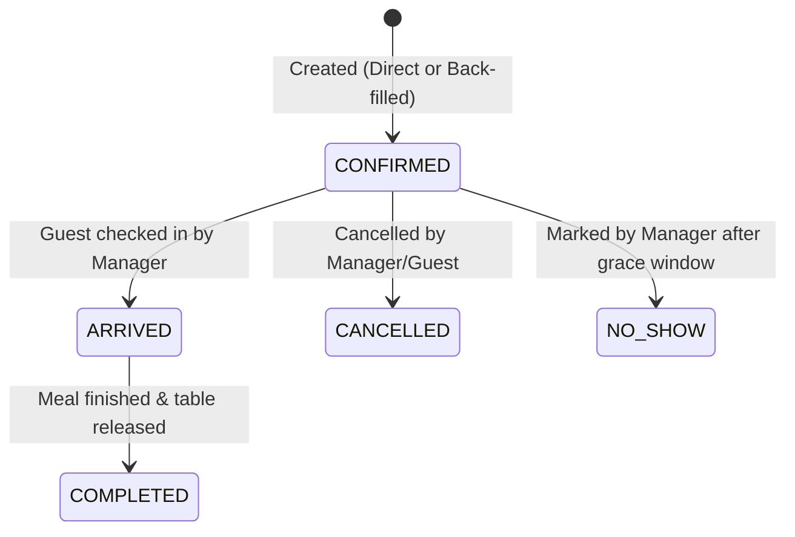

# Data Model: Manager Portal Upgrade & Authentication

**Feature**: `014-manager-portal-upgrade`  
**Date**: 2026-09-16  
**Status**: Completed

---

## 1. Client-Side Entities (Frontend Manager Portal)

### ManagerSession
Represents the authenticated manager's security state within the browser context.

| Field | Type | Description |
|-------|------|-------------|
| `authenticated` | `boolean` | True if OIDC token is held and validated |
| `username` | `string` | User login handle from Keycloak token (`preferred_username`) |
| `fullName` | `string` | Formatted user display name (`name` or `firstName + lastName`) |
| `email` | `string` | User contact email |
| `roles` | `string[]` | Array of realm roles extracted from `tokenParsed.realm_access.roles` |
| `isManager` | `boolean` | Computed helper: `roles.includes('RESTAURANT_MANAGER') \|\| roles.includes('ADMIN')` |
| `token` | `string` | Active JWT access token |
| `refreshToken` | `string` | OIDC refresh token for silent session renewal |
| `tokenParsed` | `object` | Decoded JWT payload |

**Validation Rules**:
- Portal operations unlock **only** when `authenticated === true` and `isManager === true`.
- If `isManager === false`, state transitions to `UNAUTHORIZED_ACCESS_DENIED`.

---

### PortalViewState
Represents the UI state of the manager portal single-page application.

| Field | Type | Description |
|-------|------|-------------|
| `activeTab` | `enum` | `'analytics' \| 'reservations' \| 'tables' \| 'availability' \| 'waitlist'` |
| `selectedRestaurantId` | `UUID \| null` | Currently selected restaurant in dropdown; `null` represents "All Restaurants" |
| `restaurantsList` | `RestaurantView[]` | Cached list of restaurants loaded on startup |
| `currentDateFilter` | `LocalDate` | Date filter for reservations/waiting list views (defaults to today) |
| `statusFilter` | `string` | Filter for reservation status (`ALL`, `CONFIRMED`, `ARRIVED`, etc.) |
| `loading` | `boolean` | Spinner state during asynchronous API operations |
| `errorMessage` | `string \| null` | Top-level or scoped error alert message |

---

## 2. Domain Entities (Microservice Interfaces)

### RestaurantView (from `restaurant-service`)
Represents an establishment and its physical configuration.

| Field | Type | Constraints | Description |
|-------|------|-------------|-------------|
| `id` | `UUID` | Primary Key | Unique establishment identifier |
| `name` | `string` | 1..100 chars | Display name of restaurant |
| `address` | `string` | 1..255 chars | Physical venue address |
| `timezone` | `string` | Valid IANA ID | e.g. `Europe/Amsterdam` |
| `defaultReservationDurationMinutes` | `int` | > 0, default 90 | Standard dining duration |
| `minBookingAdvanceMinutes` | `int` | >= 0, default 30 | Minimum lead time for booking |
| `maxBookingHorizonDays` | `int` | 1..365, default 60 | Maximum future booking limit |
| `cancellationWindowHours` | `int` | >= 0, default 2 | Policy window for cancellations |

---

### DiningTable (from `restaurant-service`)
Individual dining table inventory.

| Field | Type | Constraints | Description |
|-------|------|-------------|-------------|
| `id` | `UUID` | Primary Key | Unique table identifier |
| `tableNumber` | `string` | 1..50 chars | Venue table label (e.g. "T1", "B4") |
| `capacity` | `int` | 1..50 | Maximum seating count |
| `zone` | `string` | 1..50 chars | Floor location (e.g. "Main Dining", "Patio", "Bar") |

---

### ReservationRecord (from `reservation-service`)
Dining booking record and lifecycle tracker.

| Field | Type | Constraints | Description |
|-------|------|-------------|-------------|
| `id` | `UUID` | Primary Key | Unique reservation identifier |
| `restaurantId` | `UUID` | Foreign Key | Associated restaurant |
| `customerId` | `UUID` | Optional | Customer profile identifier |
| `customerName` | `string` | 1..200 chars | Guest name |
| `customerEmail` | `string` | Valid email | Guest email for notifications |
| `partySize` | `int` | 1..50 | Headcount |
| `startTime` | `Instant` | Valid instant | Scheduled arrival timestamp (ISO-8601) |
| `endTime` | `Instant` | > startTime | Estimated completion timestamp |
| `status` | `ReservationStatus` | Enum | `CONFIRMED`, `ARRIVED`, `COMPLETED`, `CANCELLED`, `NO_SHOW` |
| `allocatedTables` | `UUID[]` | List | Assigned table UUIDs |

**Lifecycle State Transitions**:

---

### WaitingListEntry (from `waiting-list-service`)
FIFO queue entry for guests awaiting cancellation openings.

| Field | Type | Constraints | Description |
|-------|------|-------------|-------------|
| `id` | `UUID` | Primary Key | Unique waitlist entry identifier |
| `restaurantId` | `UUID` | Foreign Key | Associated restaurant |
| `customerId` | `UUID` | UUID | Guest user ID |
| `customerEmail` | `string` | Valid email | Guest notification email |
| `targetDate` | `LocalDate` | Present/Future | Requested dining date |
| `earliestTime` | `LocalTime` | HH:mm:ss | Start of acceptable arrival window |
| `latestTime` | `LocalTime` | >= earliestTime | End of acceptable arrival window |
| `partySize` | `int` | 1..50 | Seating headcount |
| `status` | `string` | Enum | `WAITING`, `OFFERED`, `CONVERTED`, `EXPIRED`, `CANCELLED` |
| `createdAt` | `Instant` | Timestamp | Queue priority instant (FIFO ordering) |

---

### AnalyticsSummary (from `analytics-service`)
Real-time aggregated KPIs for executive and operational tracking.

| Field | Type | Description |
|-------|------|-------------|
| `totalReservations` | `long` | Cumulative total of confirmed reservations |
| `cancelledReservations` | `long` | Count of cancelled reservations |
| `noShows` | `long` | Count of no-show reservations |
| `waitingListEntries` | `long` | Total entries placed on the waiting list |
| `waitingListConversionRate` | `double` | % of waitlist guests converted to reservations |
| `averagePartySize` | `double` | Average seats per reservation |
| `cancellationRate` | `double` | % of bookings cancelled |
| `cancellationCategoryBreakdown` | `Map<String, Long>` | Cancellations categorized by reason |
| `partySizeDistribution` | `Map<Integer, Long>` | Headcount distribution histogram |
