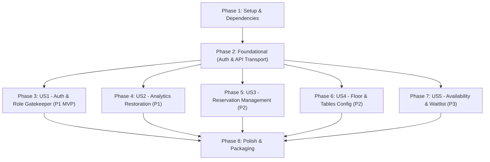

# Implementation Tasks: Manager Portal Upgrade & Authentication

**Feature**: `014-manager-portal-upgrade`  
**Plan**: [plan.md](file:///Users/lazolazarev/projects/springboot_rube_goldberg/specs/014-manager-portal-upgrade/plan.md) | **Spec**: [spec.md](file:///Users/lazolazarev/projects/springboot_rube_goldberg/specs/014-manager-portal-upgrade/spec.md)

---

## Phase 1: Setup & Shared Infrastructure

**Purpose**: Project initialization, dependency imports, and static asset mapping

- [X] T001 Verify gateway static route mapping and Keycloak client settings in `gateway/src/main/resources/application.yml`, establishing `ui/src/manager/` as the primary edit source mirrored to `gateway/src/main/resources/static/ui/manager/`
- [X] T002 [P] Import Keycloak JS adapter (v26.1.0) and Bootstrap 5 icons in `ui/src/manager/index.html`

---

## Phase 2: Foundational (Blocking Prerequisites)

**Purpose**: Core security state management and API communication infrastructure that MUST be completed before user stories

**⚠️ CRITICAL**: No user story implementation can function without this foundation

- [X] T003 [P] Implement Keycloak OIDC PKCE initialization, session management, and role claim extraction (`ROLE_RESTAURANT_MANAGER`, `ROLE_ADMIN`) in `ui/src/manager/app.js`
- [X] T004 [P] Implement authenticated API client helper with preemptive token refresh (`keycloak.updateToken(10)`), Bearer header injection, and RFC 7807 problem detail error parsing in `ui/src/manager/app.js`
- [X] T005 [P] Create dashboard layout shell, navbar with manager identity badge, restaurant selector dropdown, and tab navigation structure in `ui/src/manager/index.html`
- [X] T006 Implement dynamic restaurant catalog fetching via `GET /api/v1/restaurants` to populate the restaurant dropdown with active establishment and "All Restaurants" options in `ui/src/manager/app.js`

**Checkpoint**: Foundation ready — Keycloak token lifecycle, authenticated API transport, and layout shell operational.

---

## Phase 3: User Story 1 - Authentication & Role-Based Access Control (Priority: P1) 🎯 MVP

**Goal**: Guard portal behind Keycloak authentication; display sign-in prompt to unauthenticated visitors; deny access with clear explanation to non-managers; display manager identity and Sign Out button for authorized managers.

**Independent Test**: Navigate to `/ui/manager/index.html` unauthenticated (verify login prompt); log in with `customer1` (verify Access Denied); log in with `manager1` (verify dashboard unlock and user badge).

### Implementation for User Story 1

- [X] T007 [US1] Create unauthenticated login gate screen with "Sign in with Keycloak" redirect trigger in `ui/src/manager/index.html`
- [X] T008 [US1] Create access denied screen for authenticated users lacking manager/admin roles with role details and sign-out button in `ui/src/manager/index.html`
- [X] T009 [US1] Implement session sign-out handler invoking `keycloak.logout()` and clearing cached tokens in `ui/src/manager/app.js`
- [X] T010 [US1] Implement authentication state gatekeeper rendering logic (switching between login gate, access denied, and manager dashboard) in `ui/src/manager/app.js`

**Checkpoint**: User Story 1 complete — portal access is fully secured with role-based gatekeeping and session lifecycle management.

---

## Phase 4: User Story 2 - Operational Analytics & Live Performance Insights (Priority: P1)

**Goal**: Restore real-time operational analytics (`/api/v1/analytics/summary`) by attaching valid Bearer tokens, supporting restaurant-scoped metrics and platform-wide aggregates, with loading spinners and retry error handling.

**Independent Test**: Authenticate as `manager1`; verify KPI cards load live data without 404; toggle restaurant selector to "All Restaurants" and verify global metrics; test manual refresh button.

### Implementation for User Story 2

- [X] T011 [US2] Update Live Analytics card elements with loading spinner states, metric containers (`mTotal`, `mCancelled`, `mWait`, `mConv`, `mNoShow`), and scoped error alert banners in `ui/src/manager/index.html`
- [X] T012 [US2] Implement `loadAnalytics(restaurantId)` attaching Bearer token, passing `?restaurantId=` for selected establishment or omitting for "All Restaurants", and populating metric cards in `ui/src/manager/app.js`
- [X] T013 [US2] Implement automatic 10-second polling interval and manual "Refresh Analytics" button event listener in `ui/src/manager/app.js`

**Checkpoint**: User Story 2 complete — analytics summary 404 is resolved and live KPI monitoring is fully functional.

---

## Phase 5: User Story 3 - Reservation Management & Table Turn Execution (Priority: P2)

**Goal**: Empower managers to view scheduled and past reservations for an establishment, filter by status, perform status transitions (`ARRIVED`, `COMPLETED`, `NO_SHOW`, `CANCELLED`), and create back-filled reservations.

**Independent Test**: Select a restaurant; list reservations; transition a booking from `CONFIRMED` to `ARRIVED` to `COMPLETED`; submit a back-filled reservation with a past start time today and confirm creation.

### Implementation for User Story 3

- [X] T014 [US3] Build Reservations tab UI with date picker, status filter (`ALL`, `CONFIRMED`, `ARRIVED`, `COMPLETED`, `NO_SHOW`, `CANCELLED`), reservation table, and "New / Back-Fill Reservation" modal dialog in `ui/src/manager/index.html`
- [X] T015 [US3] Implement `loadReservations()` querying `GET /api/v1/reservations?restaurantId=` and rendering booking rows with guest name, party size, dining time, contact details, and status badges in `ui/src/manager/app.js`
- [X] T016 [US3] Implement reservation status transition actions calling `PATCH /api/v1/reservations/{id}/status` and cancellation calling `DELETE /api/v1/reservations/{id}` in `ui/src/manager/app.js`
- [X] T017 [US3] Implement reservation creation form handler supporting retroactive start timestamps (manager back-filling) calling `POST /api/v1/reservations` in `ui/src/manager/app.js`

**Checkpoint**: User Story 3 complete — full reservation lifecycle, status transitions, and back-filling operational.

---

## Phase 6: User Story 4 - Restaurant Floor, Tables & Configuration (Priority: P2)

**Goal**: Allow managers to view venue profile, inspect and add dining tables with capacity and zone, configure table combinations, and update operating hours.

**Independent Test**: View registered tables; add a new table (e.g. `T10`, capacity 4, "Patio"); update opening hours for the establishment and verify persistence.

### Implementation for User Story 4

- [X] T018 [US4] Build Floor & Tables tab UI with restaurant profile summary, dining table inventory table, "Add Table" form, table combination list, and operating hours editor in `ui/src/manager/index.html`
- [X] T019 [US4] Implement `loadTablesAndHours(restaurantId)` querying `GET /api/v1/restaurants/{id}/tables` and `GET /api/v1/restaurants/{id}/opening-hours` in `ui/src/manager/app.js`
- [X] T020 [US4] Implement dining table creation form handler (`POST /api/v1/restaurants/{id}/tables`) and table combination configuration handler (`POST /api/v1/restaurants/{id}/table-combinations`) in `ui/src/manager/app.js`
- [X] T021 [US4] Implement operating hours form update handler calling `PUT /api/v1/restaurants/{id}/opening-hours` in `ui/src/manager/app.js`
- [X] T022 [US4] Implement new establishment registration modal and handler calling `POST /api/v1/restaurants` in `ui/src/manager/app.js`

**Checkpoint**: User Story 4 complete — physical floor configuration, table inventory, and operational hours management functional.

---

## Phase 7: User Story 5 - Live Seating Availability Checks & Waiting List Oversight (Priority: P3)

**Goal**: Provide real-time table availability inquiries (supporting manager retroactive checks) and active waiting list queue inspection backed by a newly authorized backend query endpoint in `waiting-list-service`.

**Independent Test**: Perform an availability check for a past slot today (verifying manager bypass); view the active waiting list queue for the selected restaurant; verify slice tests pass.

### Implementation for User Story 5

- [X] T023 [P] [US5] Add `findByRestaurantIdAndTargetDateAndStatusOrderByCreatedAtAsc` and `findByRestaurantIdAndStatusOrderByCreatedAtAsc` query methods in `services/waiting-list-service/src/main/java/nl/invokedynamic/demo/waitinglist/repository/WaitingListEntryRepository.java`
- [X] T024 [US5] Implement `getWaitingList(restaurantId, targetDate, status)` method in `services/waiting-list-service/src/main/java/nl/invokedynamic/demo/waitinglist/service/WaitingListService.java`
- [X] T025 [US5] Implement `GET /api/v1/waiting-list` endpoint accepting `restaurantId`, optional `targetDate`, and optional `status` in `services/waiting-list-service/src/main/java/nl/invokedynamic/demo/waitinglist/api/WaitingListController.java`
- [X] T026 [US5] Configure Spring Security authorization rules for `GET /api/v1/waiting-list/**` restricting access to `ROLE_RESTAURANT_MANAGER` and `ROLE_ADMIN` in `services/waiting-list-service/src/main/java/nl/invokedynamic/demo/waitinglist/config/SecurityConfig.java`
- [X] T027 [P] [US5] Add Spring slice tests for `GET /api/v1/waiting-list` verifying 200 for manager/admin and 403 for customer/unauthenticated in `services/waiting-list-service/src/test/java/nl/invokedynamic/demo/waitinglist/api/WaitingListControllerWebMvcTest.java` and `services/waiting-list-service/src/test/java/nl/invokedynamic/demo/waitinglist/WaitingListSecurityTest.java`
- [X] T028 [US5] Build Availability & Waiting List tab UI with availability search form, candidate slot results container, and chronological waiting list queue table in `ui/src/manager/index.html`
- [X] T029 [US5] Implement table availability check handler calling `GET /api/v1/availability` with date, time, party size, and restaurant ID in `ui/src/manager/app.js`
- [X] T030 [US5] Implement `loadWaitingList(restaurantId)` calling `GET /api/v1/waiting-list?restaurantId=` and rendering active waiting entries in `ui/src/manager/app.js`

**Checkpoint**: User Story 5 complete — live table availability inquiries and waiting list queue oversight fully integrated end-to-end.

---

## Phase 8: Polish & Cross-Cutting Concerns

**Purpose**: Static asset packaging, checklist re-validation, and reactor test suite execution

- [X] T031 [P] Synchronize manager portal static assets ensuring `ui/src/manager/` and `gateway/src/main/resources/static/ui/manager/` are bit-for-bit identical before packaging
- [X] T032 [P] Re-evaluate and record pass status in `specs/014-manager-portal-upgrade/checklists/requirements.md` and `specs/014-manager-portal-upgrade/checklists/manager-portal.md`
- [X] T033 Execute full Maven reactor build and test suite (`mvn clean test`) across all modules to verify zero regressions
- [X] T034 Execute end-to-end validation scenarios documented in `specs/014-manager-portal-upgrade/quickstart.md`

---

## Dependencies & Execution Order

### Phase Dependencies

- **Phase 1 (Setup)**: Can start immediately.
- **Phase 2 (Foundational)**: Depends on Phase 1; blocks all user stories.
- **Phases 3-7 (User Stories)**: Depend on Phase 2; can proceed in priority order (P1 → P2 → P3) or in parallel where file boundaries permit.
- **Phase 8 (Polish)**: Depends on all user stories being complete.

---

## Parallel Opportunities

- **Foundational Phase**:
  - `T003` (Keycloak auth state in `app.js`) and `T005` (Dashboard shell layout in `index.html`) can be developed in parallel.
- **Backend Waiting List Work (US5)**:
  - `T023`, `T024`, `T025`, `T026`, and `T027` in `waiting-list-service` can be implemented and tested completely in parallel with frontend UI tasks in `ui/src/manager/`.
- **Polish Phase**:
  - `T031` (Static asset sync) and `T032` (Checklist verification) can run in parallel.

---

## Implementation Strategy

### MVP Milestone (Phases 1, 2, & 3)
1. Complete Setup and Foundational authentication & API client (`T001` - `T006`).
2. Implement User Story 1 (`T007` - `T010`).
3. **Verify MVP**: Test unauthenticated gatekeeper, customer 403 access denied, and manager dashboard unlock.

### Increment 2 (User Story 2)
1. Complete Analytics restoration (`T011` - `T013`).
2. **Verify**: Authenticated manager sees live KPI cards from `/api/v1/analytics/summary` without 404.

### Increment 3 (User Stories 3 & 4)
1. Complete Reservation management and back-filling (`T014` - `T017`).
2. Complete Floor tables and operating hours (`T018` - `T022`).
3. **Verify**: Status transitions, walk-in back-filling, and table creations persist.

### Increment 4 (User Story 5 & Polish)
1. Implement backend `GET /api/v1/waiting-list` and frontend queue/availability views (`T023` - `T030`).
2. Synchronize static assets to gateway and execute Maven reactor test suite (`T031` - `T034`).
