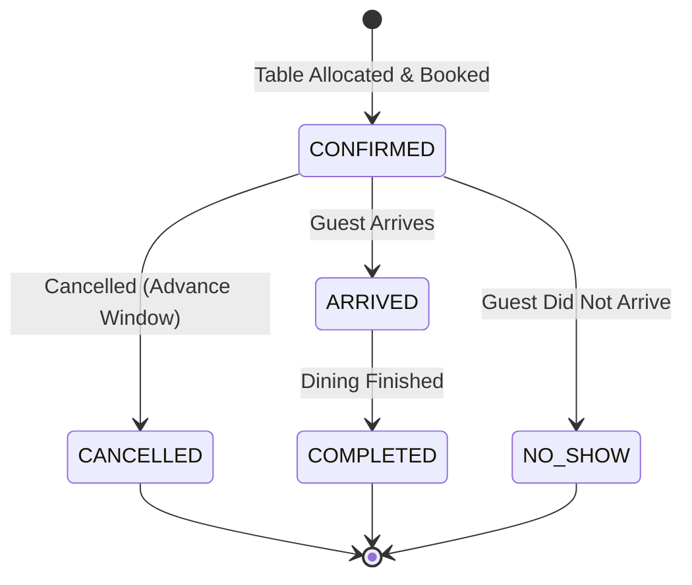
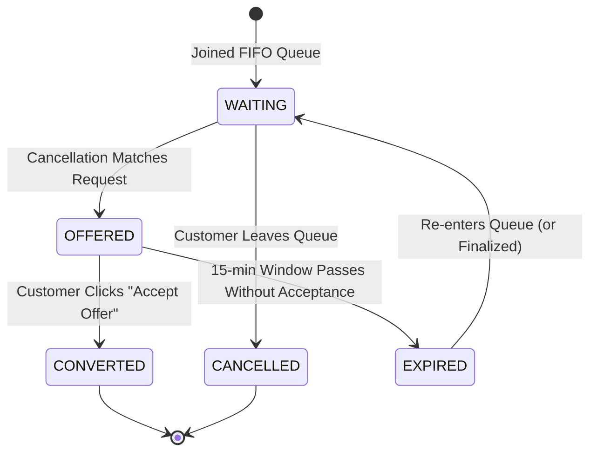

# Data Model: Customer Portal Upgrade

**Feature**: Customer Portal Upgrade (`015-customer-portal-upgrade`)
**Date**: 2026-09-17

## 1. Entity Definitions

### 1.1 Customer Profile (Client-Side & Service Representation)
Represents the authenticated customer identity extracted from Keycloak OIDC claims and matched in `customer-service`.

| Field | Type | Required | Description | Example |
|-------|------|----------|-------------|---------|
| `sub` | UUID / String | Yes | Subject identifier from JWT token | `a1b2c3d4-e5f6-7890-abcd-ef1234567890` |
| `email` | String | Yes | Customer contact email address | `customer1@example.com` |
| `displayName` | String | Yes | Formatted name (`preferred_username` or `given_name family_name`) | `Alice Customer` |
| `roles` | List<String> | Yes | Keycloak realm roles | `["CUSTOMER", "offline_access"]` |

---

### 1.2 Table Availability Models

#### Availability Query Parameters
| Parameter | Type | Required | Constraints | Description |
|-----------|------|----------|-------------|-------------|
| `restaurantId` | UUID | Yes | Valid UUID | Target restaurant |
| `date` | LocalDate | Yes | Current or future date (ISO-8601 `YYYY-MM-DD`) | `2026-09-20` |
| `time` | LocalTime | Yes | Time format (`HH:mm:ss`) | `19:00:00` |
| `partySize` | Integer | Yes | Between 1 and 50 | `4` |

#### Availability Response (`AvailabilityResponse`)
| Field | Type | Description | Example |
|-------|------|-------------|---------|
| `isAvailable` | Boolean | True if capacity exists; false if fully booked | `true` |
| `availableSlots` | List<LocalTime> | List of open seating times around the requested time | `["18:30:00", "19:00:00", "19:30:00"]` |
| `availableTables` | List<TableCandidate> | Physical tables candidate list | `[{"tableId": "...", "capacity": 4}]` |
| `combinations` | List<CombinationCandidate> | Multi-table combination candidates | `[]` |

---

### 1.3 Dining Reservation Models

#### Create Reservation Request (`CreateReservationRequest`)
| Field | Type | Required | Description |
|-------|------|----------|-------------|
| `restaurantId` | UUID | Yes | Target restaurant identifier |
| `customerId` | UUID | Yes | Customer subject identifier |
| `customerName` | String | Yes | Name of reserving customer |
| `customerEmail` | String | Yes | Contact email for notifications |
| `partySize` | Integer | Yes | Number of guests (1-50) |
| `startTime` | Instant | Yes | Reservation start timestamp (ISO-8601 UTC) |
| `durationMinutes` | Integer | No | Seating duration (defaults to 90 min) |
| `availableTables` | List<TableCandidate> | No | Table allocation hint from availability |

#### Reservation Response (`ReservationResponseDto`)
| Field | Type | Description | Lifecycle Values |
|-------|------|-------------|------------------|
| `id` | UUID | Reservation unique identifier | Generated UUID |
| `restaurantId` | UUID | Restaurant identifier | Valid UUID |
| `customerId` | UUID | Reserving customer identifier | Valid UUID |
| `customerName` | String | Customer display name | Text |
| `customerEmail` | String | Customer email | Valid email |
| `partySize` | Integer | Party guest count | 1 - 50 |
| `startTime` | Instant | Dining start timestamp | Future timestamp |
| `endTime` | Instant | Dining end timestamp | Start + duration |
| `status` | String | Current lifecycle status | `CONFIRMED`, `ARRIVED`, `COMPLETED`, `CANCELLED`, `NO_SHOW` |
| `allocatedTableIds`| List<UUID>| Allocated table physical IDs | UUID list |

---

### 1.4 Waiting List Models

#### Join Waiting List Request (`JoinWaitingListRequest`)
| Field | Type | Required | Constraints | Description |
|-------|------|----------|-------------|-------------|
| `restaurantId` | UUID | Yes | Valid UUID | Restaurant identifier |
| `customerId` | UUID | Yes | Valid UUID | Reserving customer ID |
| `customerEmail` | String | Yes | Valid email, max 255 | Contact email for notifications and offers |
| `targetDate` | LocalDate | Yes | Current/future, <= 365 days | Requested dining date |
| `earliestTime` | LocalTime | Yes | `earliestTime <= latestTime` | Earliest acceptable arrival time (default ±1h) |
| `latestTime` | LocalTime | Yes | `latestTime >= earliestTime` | Latest acceptable arrival time (default ±1h) |
| `partySize` | Integer | Yes | 1 to 50 | Number of guests |

#### Waiting List Entry Entity (`WaitingListEntryEntity`)
| Field | Type | Description | Status Values |
|-------|------|-------------|---------------|
| `id` | UUID | Queue entry identifier | Generated UUID |
| `restaurantId` | UUID | Restaurant identifier | Valid UUID |
| `customerId` | UUID | Customer identifier | Valid UUID |
| `customerEmail` | String | Contact email | Valid email |
| `targetDate` | LocalDate | Target dining date | `YYYY-MM-DD` |
| `earliestTime` | LocalTime | Earliest seating time | `HH:mm:ss` |
| `latestTime` | LocalTime | Latest seating time | `HH:mm:ss` |
| `partySize` | Integer | Party guest count | 1 - 50 |
| `status` | String | Entry status in queue | `WAITING`, `OFFERED`, `CONVERTED`, `EXPIRED`, `CANCELLED` |
| `createdAt` | Instant | Creation timestamp (FIFO order) | UTC Instant |

#### Waiting List Offer Model (`WaitingListOfferEntity`)
| Field | Type | Description | Example |
|-------|------|-------------|---------|
| `id` | UUID | Unique offer identifier | Generated UUID |
| `waitingListEntryId` | UUID | Linked waiting list entry | Valid UUID |
| `restaurantId` | UUID | Restaurant identifier | Valid UUID |
| `offeredStartTime` | Instant | Opening seating timestamp | `2026-09-20T19:00:00Z` |
| `releasedTableIds` | List<UUID> | Reserved physical tables | UUID list |
| `expiresAt` | Instant | Offer claim expiration deadline (15 min) | `now() + 15m` |
| `status` | String | Offer status | `PENDING`, `ACCEPTED`, `EXPIRED` |

---

### 1.5 Real-Time Customer Push Notification (SSE) Model

Payload broadcasted over `/api/v1/notifications/stream` to the authenticated customer:

```json
{
  "eventId": "3fa85f64-5717-4562-b3fc-2c963f66afa6",
  "eventType": "WAITING_LIST_OFFER",
  "customerId": "c7128e4e-0a56-43b8-89c5-7f2834789b12",
  "timestamp": "2026-09-20T17:30:00Z",
  "data": {
    "offerId": "9b1deb4d-3b7d-4bad-9bdd-2b0d7b3dcb6d",
    "waitingListEntryId": "1b9d6bcd-bbfd-4b2d-9b5d-ab8dfbbd4bed",
    "restaurantId": "550e8400-e29b-41d4-a716-446655440000",
    "offeredStartTime": "2026-09-20T19:00:00Z",
    "expiresAt": "2026-09-20T17:45:00Z"
  }
}
```

Supported `eventType` constants:
- `RESERVATION_CONFIRMED`: Sent when a reservation is successfully created.
- `RESERVATION_CANCELLED`: Sent when a reservation is cancelled.
- `WAITING_LIST_OFFER`: Sent when a cancellation opens a table and a 15-minute offer is extended to the customer.

---

## 2. State Transition Diagrams

### Dining Reservation Lifecycle


### Waiting List Entry & Offer Lifecycle

