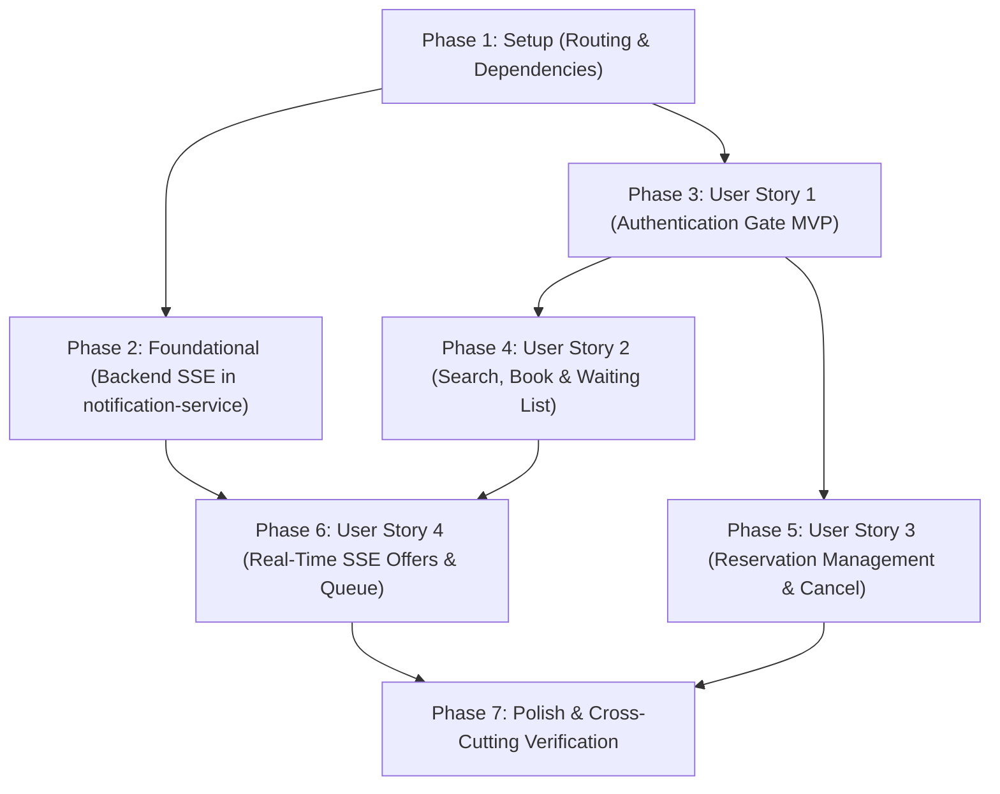

# Tasks: Customer Portal Upgrade

**Feature**: Customer Portal Upgrade (`015-customer-portal-upgrade`)
**Date**: 2026-09-17
**Spec**: [spec.md](./spec.md) | **Plan**: [plan.md](./plan.md)

---

## Phase 1: Setup (Shared Infrastructure & Gateway Routing)

**Purpose**: Establish routing configuration, dependencies, and shared client adapters.

- [X] T001 Configure Spring Cloud Gateway route for notification-service in `gateway/src/main/resources/application.yml` (`Path=/api/v1/notifications, /api/v1/notifications/**` -> `${NOTIFICATION_SERVICE_URI:http://localhost:8088}`)
- [X] T002 [P] Add `spring-boot-starter-security` and `spring-boot-starter-oauth2-resource-server` dependencies to `services/notification-service/pom.xml`
- [X] T003 [P] Copy self-hosted `keycloak.js` to `ui/src/customer/keycloak.js` and `gateway/src/main/resources/static/ui/customer/keycloak.js`

---

## Phase 2: Foundational (Backend SSE Streaming & Event Bridge in notification-service)

**Purpose**: Establish the real-time Server-Sent Events (SSE) infrastructure in `notification-service` to broadcast Kafka domain events to connected browser sessions.

**⚠️ CRITICAL**: Must be completed before real-time offer claims and push notifications in User Story 4.

- [X] T004 Create `CustomerSseEmitterService` in `services/notification-service/src/main/java/nl/invokedynamic/demo/notification/service/CustomerSseEmitterService.java` with thread-safe `ConcurrentHashMap` emitter registry, a 25-second scheduled heartbeat ping (to prevent proxy/gateway idle timeouts), timeout/completion callbacks, and targeted dispatch by customer identifier
- [X] T005 [P] Create `NotificationSseController` in `services/notification-service/src/main/java/nl/invokedynamic/demo/notification/api/NotificationSseController.java` exposing `GET /api/v1/notifications/stream` returning `SseEmitter` with `text/event-stream` media type and extracting customer identity from `@AuthenticationPrincipal Jwt jwt`
- [X] T006 [P] Create `SecurityConfig` in `services/notification-service/src/main/java/nl/invokedynamic/demo/notification/config/SecurityConfig.java` configuring OAuth2 resource server with JWT decoding for `/api/v1/notifications/**` while permitting actuator health and prometheus endpoints
- [X] T007 Update `NotificationEventListener` in `services/notification-service/src/main/java/nl/invokedynamic/demo/notification/events/NotificationEventListener.java` to format and dispatch named SSE events (`RESERVATION_CONFIRMED`, `RESERVATION_CANCELLED`, and `WAITING_LIST_OFFER`) matching the API contract via `CustomerSseEmitterService.sendToCustomer`
- [X] T008 [P] Add unit and WebMvc slice tests in `services/notification-service/src/test/java/nl/invokedynamic/demo/notification/api/NotificationSseControllerWebMvcTest.java` and `services/notification-service/src/test/java/nl/invokedynamic/demo/notification/service/CustomerSseEmitterServiceUnitTest.java`

**Checkpoint**: Backend SSE streaming infrastructure is tested and ready to stream real-time events to connected clients.

---

## Phase 3: User Story 1 - Secure Authentication and Role-Based Customer Access (Priority: P1) 🎯 MVP

**Goal**: Deliver an unauthenticated landing gate, Keycloak OIDC login/logout with PKCE, and role-based gatekeeping (`CUSTOMER`, `ROLE_CUSTOMER`, `ADMIN`).

**Independent Test**: Load `http://localhost:8080/ui/customer/index.html` unauthenticated; verify booking controls are hidden and sign-in button is displayed. Log in as `alice`/`password`; verify user badge and interactive portal display. Log out; verify return to sign-in gate.

- [X] T009 [US1] Build unauthenticated landing card, auth loading view (spinner with `d-none`/`d-flex` safe toggling), unauthorized access screen, and customer header in `ui/src/customer/index.html`
- [X] T010 [US1] Implement Keycloak OIDC PKCE initialization, check-sso flow, token auto-refresh (10s window), and authenticated fetch wrapper (`authFetch`) in `ui/src/customer/app.js`
- [X] T011 [US1] Implement customer role verification in `ui/src/customer/app.js` accepting `CUSTOMER`, `ROLE_CUSTOMER`, or `ADMIN`, rendering user profile details (`name`, `email`) in header, and handling sign-out
- [X] T012 [US1] Synchronize static files to `gateway/src/main/resources/static/ui/customer/` and verify unauthenticated landing gate and login flow

**Checkpoint**: User Story 1 is functional and verifiable independently as a standalone secure customer gate MVP.

---

## Phase 4: User Story 2 - Guided Table Search, Direct Booking & Conditional Waiting List Flow (Priority: P1)

**Goal**: Allow customers to search table availability, book instantly when available, or opt-in to the waiting list with a pre-populated ±1 hour window when fully booked.

**Independent Test**: Search for an available slot and click "Book Table" to confirm instant reservation. Search for a fully booked slot; verify the instant booking button is hidden, and verify the "Join Waiting List" prompt pre-populates ±1 hour arrival times and puts the customer on the queue only upon confirmation.

- [X] T013 [US2] Implement dynamic restaurant dropdown population calling `GET /api/v1/restaurants` in `ui/src/customer/app.js`
- [X] T014 [US2] Implement table availability search form and interactive results container in `ui/src/customer/index.html` and `ui/src/customer/app.js` querying `GET /api/v1/availability`
- [X] T015 [US2] Implement instant guaranteed reservation booking action in `ui/src/customer/app.js` calling `POST /api/v1/reservations` with authenticated customer credentials and table allocation candidates
- [X] T016 [US2] Implement conditional waiting list opt-in card in `ui/src/customer/index.html` and `ui/src/customer/app.js` that renders upon unavailable search results, pre-populates a ±1 hour window around searched time (with adjust controls), and calls `POST /api/v1/waiting-list` upon explicit customer consent

**Checkpoint**: User Stories 1 and 2 deliver an end-to-end booking and waitlist placement experience.

---

## Phase 5: User Story 3 - Managing and Cancelling Upcoming Reservations (Priority: P2)

**Goal**: Enable customers to review upcoming dining reservations and cancel bookings within allowable policy windows with a confirmation modal.

**Independent Test**: Book a reservation, verify it displays under "Upcoming Reservations", click "Cancel", confirm in the modal, and verify status transitions to `CANCELLED` and table capacity is released.

- [X] T017 [US3] Add Upcoming Reservations card, table layout, status badges, and empty-state placeholders in `ui/src/customer/index.html`
- [X] T018 [US3] Ensure `GET /api/v1/reservations` in `services/reservation-service/src/main/java/nl/invokedynamic/demo/reservation/api/ReservationController.java` supports optional `restaurantId` when `customerId` is provided (delegating to `reservationRepository.findByCustomerId`), and implement customer reservation retrieval and display in `ui/src/customer/app.js`
- [X] T019 [US3] Implement cancellation confirmation modal and handler in `ui/src/customer/app.js` calling `DELETE /api/v1/reservations/{id}` with policy window validation and error alert handling

**Checkpoint**: Customers can inspect and cancel their reservations with full self-service control.

---

## Phase 6: User Story 4 - Tracking, Claiming Offers, and Leaving Waiting List Queues (Priority: P2)

**Goal**: Enable customers to track active waiting list entries, receive real-time SSE push offers with a 15-minute countdown timer, accept offers with one click, or voluntarily leave the queue.

**Independent Test**: Join waiting list; verify entry appears. Trigger an offer opening; verify SSE push delivers offer, active countdown begins, and clicking "Accept Offer" converts it to a confirmed reservation. Test clicking "Leave Waiting List" to cancel queue placement.

- [X] T020 [US4] Add Active Waiting List section, entry cards, and real-time offer callout container in `ui/src/customer/index.html`
- [X] T021 [US4] Ensure `GET /api/v1/waiting-list` in `services/waiting-list-service/src/main/java/nl/invokedynamic/demo/waitinglist/api/WaitingListController.java` supports optional `restaurantId` when `customerId` is provided (delegating to `entryRepository.findByCustomerId`), and implement customer waiting list entry fetching and rendering in `ui/src/customer/app.js`
- [X] T022 [US4] Implement real-time Server-Sent Events (SSE) client listener in `ui/src/customer/app.js` connecting to `/api/v1/notifications/stream` with exponential-backoff reconnection and dispatch handlers
- [X] T023 [US4] Implement time-limited offer banner in `ui/src/customer/app.js` with active 15-minute countdown timer (`expiresAt`) and instant "Accept Offer" action calling `POST /api/v1/waiting-list/offers/{offerId}/accept`
- [X] T024 [US4] Implement self-service "Leave Waiting List" action with confirmation prompt in `ui/src/customer/app.js`

**Checkpoint**: Full real-time push and queue fulfillment loop complete.

---

## Phase 7: Polish & Cross-Cutting Concerns

**Purpose**: Asset synchronization, full verification, and build quality assurance.

- [X] T025 Synchronize all UI updates from `ui/src/customer/*` into `gateway/src/main/resources/static/ui/customer/`
- [X] T026 Execute end-to-end verification scenarios defined in `specs/015-customer-portal-upgrade/quickstart.md`
- [X] T027 Run `./mvnw test` across all reactor modules ensuring 100% build and test pass

---

## Dependencies & Execution Order

### Phase Dependencies

### User Story Execution Flow

1. **User Story 1 (P1 - MVP)**: Can begin immediately after Phase 1 setup. Establishes the OIDC gatekeeper and authenticated session foundation.
2. **User Story 2 (P1)**: Extends authenticated session with availability search, instant booking, and conditional wait-listing.
3. **User Story 3 (P2)**: Extends dashboard with reservation tracking and cancellation.
4. **User Story 4 (P2)**: Integrates with Phase 2 SSE backend for real-time push, live 15-minute countdown timer, and one-click offer claim.

---

## Implementation Strategy

### MVP Milestone (Phases 1, 2 & 3)
1. Complete Gateway routing and notification-service dependencies.
2. Implement backend SSE endpoint in `notification-service`.
3. Deliver the Keycloak authentication gate in the Customer Portal (`ui/src/customer/`).
4. **Validation Checkpoint**: Verify secure authentication, token refresh, and customer role gatekeeping.

### Incremental Delivery (Phases 4, 5 & 6)
1. Add adaptive search, instant booking, and conditional waiting list (User Story 2).
2. Add upcoming reservations and cancellation modal (User Story 3).
3. Connect SSE event stream, real-time offer countdown, and queue removal (User Story 4).
4. Run full Maven test suite and quickstart verification scenarios.
