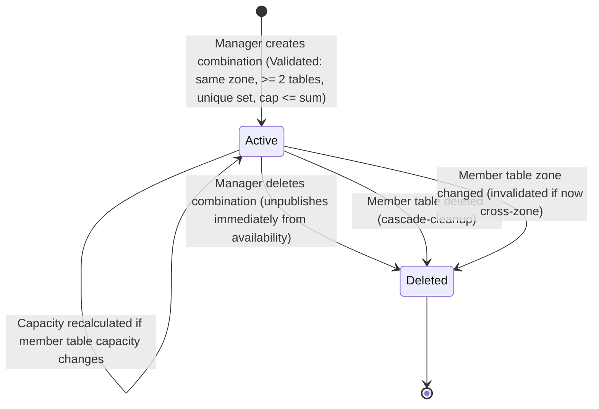

# Data Model: Table Combination Management & Capacity Optimization

**Feature**: `017-table-combinations`  
**Date**: 2026-09-18

---

## 1. Entities & Attributes

### `TableCombination`
Represents a logical, temporary or reconfigurable grouping of two or more physical dining tables within the same floor zone.

| Field | Type | Nullable | Description / Constraints |
|---|---|---|---|
| `id` | `UUID` | No | Primary key, generated randomly on creation. |
| `restaurantId` | `UUID` | No | Reference to the owning restaurant. |
| `name` | `VARCHAR(50)` | No | Display name/label (e.g. "Combo: T1 + T2"). Auto-generated if not supplied. |
| `zone` | `VARCHAR(50)` | Yes | The common floor zone of all constituent tables (e.g. "Main Dining Room"). |
| `tableIds` | `UUID[]` (List<UUID>) | No | Constituent physical table IDs. Must contain $\ge 2$ distinct IDs. |
| `combinedCapacity` | `INTEGER` | No | Total seating capacity when joined. Must be $> 0$ and $\le \sum \text{capacity}(T_i)$. |

---

### `RestaurantTable` (Existing Entity Reference)
Represents an individual physical dining table unit on the restaurant floor.

| Field | Type | Nullable | Description / Constraints |
|---|---|---|---|
| `id` | `UUID` | No | Primary key. |
| `restaurantId` | `UUID` | No | Reference to owning restaurant. |
| `tableNumber` | `VARCHAR(20)` | No | Table label (e.g., "T1", "Patio-2"). Unique per restaurant. |
| `capacity` | `INTEGER` | No | Number of physical seats at this table ($> 0$). |
| `zone` | `VARCHAR(50)` | No | Floor zone identifier (e.g. "Main Dining", "Patio", "Bar"). Default: "Main Dining". |

---

### `TableCombinationViewEntity` (Availability Read Model Reference)
Read-model projection synchronized in `availability-service` via Kafka domain events.

| Field | Type | Description |
|---|---|---|
| `id` | `UUID` | Combination ID. |
| `restaurantId` | `UUID` | Owning restaurant ID. |
| `name` | `VARCHAR(50)` | Combination name. |
| `tableIds` | `UUID[]` | Constituent table IDs. |
| `combinedCapacity` | `INTEGER` | Combined capacity. |

---

## 2. Invariants & Business Rules

1. **Minimum Table Count**:  
   $\text{count}(\text{tableIds}) \ge 2$. Single tables cannot form a combination.
2. **Same-Zone Constraint (FR-003)**:  
   For every $t \in \text{tableIds}$, $\text{table}(t).\text{zone}$ must be identical (case-insensitive, trimmed). Combinations spanning multiple zones are rejected.
3. **Order-Independent Duplicate Prevention (FR-004)**:  
   Two combinations $A$ and $B$ for the same restaurant are duplicates if and only if $\text{Set}(A.\text{tableIds}) == \text{Set}(B.\text{tableIds})$.
4. **Partial Overlap Support (FR-005)**:  
   Combinations where $\text{Set}(A.\text{tableIds}) \neq \text{Set}(B.\text{tableIds})$ are permitted even if they share one or more tables (e.g., $\{T_1, T_2\}$ and $\{T_1, T_3\}$).
5. **Capacity Upper Bound (FR-007)**:  
   $C.\text{combinedCapacity} \le \sum_{t \in C.\text{tableIds}} \text{table}(t).\text{capacity}$. If not provided, defaults to the exact sum.
6. **Restaurant Capacity Invariant (FR-006)**:  
   $\text{TotalRestaurantCapacity} = \sum_{t \in \text{Tables}} t.\text{capacity}$. Defined strictly over physical tables and unaffected by the presence of table combinations.
7. **Mutual Exclusion & Allocation (FR-009, FR-010)**:  
   A combination $C$ is available for a timeslot if and only if $\forall t \in C.\text{tableIds}, t \notin \text{OccupiedTableIds}$. Booking combination $C$ records occupancy for all $t \in C.\text{tableIds}$.

---

## 3. Lifecycle & State Transitions

