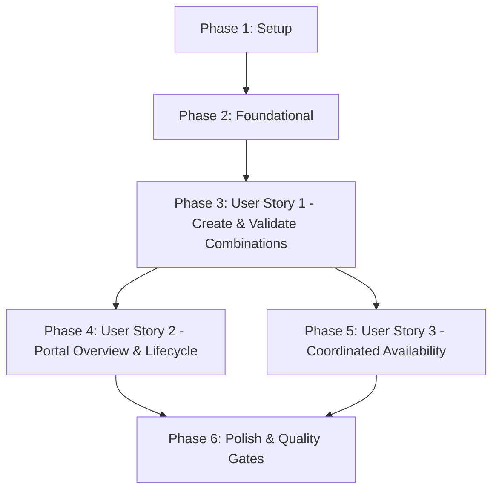

# Implementation Tasks: Table Combination Management & Capacity Optimization

**Feature**: `017-table-combinations`  
**Date**: 2026-09-18  
**Spec**: [spec.md](file:///Users/lazolazarev/projects/springboot_rube_goldberg/specs/017-table-combinations/spec.md) | **Plan**: [plan.md](file:///Users/lazolazarev/projects/springboot_rube_goldberg/specs/017-table-combinations/plan.md)

---

## Phase 1: Setup (Shared Infrastructure & Contracts)

**Purpose**: Establish data contracts, entity fields, and response DTOs across the Maven reactor.

- [X] T001 [P] Update `CombinationConfig` in `common/event-contracts/src/main/java/nl/invokedynamic/demo/events/TableConfigurationChangedEvent.java` to include `String zone` with backwards-compatible constructor
- [X] T002 [P] Create `TableCombinationResponse` record DTO in `services/restaurant-service/src/main/java/nl/invokedynamic/demo/restaurant/api/dto/TableCombinationResponse.java` containing `UUID id`, `UUID restaurantId`, `String name`, `String zone`, `List<UUID> tableIds`, `List<String> tableNumbers`, and `int combinedCapacity` per OpenAPI contract
- [X] T003 [P] Add `zone` column attribute and getter/setter in `services/restaurant-service/src/main/java/nl/invokedynamic/demo/restaurant/domain/TableCombinationEntity.java` with max length 50

---

## Phase 2: Foundational (Blocking Prerequisites)

**Purpose**: Core repository queries and shared validation utilities required before implementing user stories.

**⚠️ CRITICAL**: No user story work can begin until this phase is complete.

- [X] T004 Ensure `TableCombinationRepository` in `services/restaurant-service/src/main/java/nl/invokedynamic/demo/restaurant/repository/TableCombinationRepository.java` has `findByRestaurantId(UUID restaurantId)` and `deleteByIdAndRestaurantId(UUID id, UUID restaurantId)`
- [X] T005 Create unit test harness for combination validation rules in `services/restaurant-service/src/test/java/nl/invokedynamic/demo/restaurant/service/TableCombinationValidationTest.java`

**Checkpoint**: Foundation ready - user story implementation can now begin.

---

## Phase 3: User Story 1 - Create and Manage Same-Zone Table Combinations (Priority: P1) 🎯 MVP

**Goal**: Restaurant managers can create valid table combinations within a single floor zone, with duplicate prevention and capacity upper bounding.

**Independent Test**: Create combinations with same-zone tables, verifying default capacity equals table sum, custom capacity $\le \text{sum}$ succeeds, cross-zone combinations are rejected (HTTP 400), duplicates with reversed table order are rejected (HTTP 400), and capacity $> \text{sum}$ is rejected (HTTP 400).

### Tests for User Story 1

> **NOTE: Write these tests FIRST, ensure they FAIL before implementation**

- [X] T006 [P] [US1] Add unit tests for same-zone check, order-insensitive duplicate set matching, and custom capacity capping in `services/restaurant-service/src/test/java/nl/invokedynamic/demo/restaurant/service/TableCombinationValidationTest.java`
- [X] T007 [P] [US1] Add WebMvc tests in `services/restaurant-service/src/test/java/nl/invokedynamic/demo/restaurant/api/RestaurantControllerWebMvcTest.java` testing `POST /api/v1/restaurants/{id}/table-combinations` for 201 Created and 400 Bad Request error cases

### Implementation for User Story 1

- [X] T008 [US1] Implement same-zone validation, duplicate set detection (`Set<UUID>` comparison), default capacity summation, and custom capacity upper-bound validation ($\le \sum \text{cap}(T_i)$) in `services/restaurant-service/src/main/java/nl/invokedynamic/demo/restaurant/service/RestaurantService.java`
- [X] T009 [US1] Update `addTableCombination` in `services/restaurant-service/src/main/java/nl/invokedynamic/demo/restaurant/service/RestaurantService.java` to persist the resolved `zone` on `TableCombinationEntity` and emit `TableConfigurationChangedEvent`
- [X] T010 [US1] Update `POST /api/v1/restaurants/{id}/table-combinations` endpoint in `services/restaurant-service/src/main/java/nl/invokedynamic/demo/restaurant/api/RestaurantController.java` to validate payload and return `TableCombinationResponse` with HTTP 201

**Checkpoint**: At this point, User Story 1 is fully functional and testable independently.

---

## Phase 4: User Story 2 - Table Combination Overview and Lifecycle Management (Priority: P2)

**Goal**: Restaurant managers have a dedicated visual overview of all combinations in the manager portal, can delete combinations immediately (unpublishing them from future availability without affecting confirmed bookings), and have combinations cascade-pruned on physical table changes.

**Independent Test**: Navigate to manager portal Tab 3 ("Floor & Tables"), verify combinations are displayed in a dedicated table (name, zone, constituent tables, capacity), create a combination via the modal with zone filtering, delete a combination, and verify deletion in the catalog and event broadcast.

### Tests for User Story 2

- [X] T011 [P] [US2] Add unit tests in `services/restaurant-service/src/test/java/nl/invokedynamic/demo/restaurant/service/RestaurantServiceLifecycleTest.java` verifying `deleteTableCombination`, cascade deletion on `deleteTable`, and cross-zone pruning on `updateTable`
- [X] T012 [P] [US2] Add WebMvc tests in `services/restaurant-service/src/test/java/nl/invokedynamic/demo/restaurant/api/RestaurantControllerWebMvcTest.java` for `GET /api/v1/restaurants/{id}/table-combinations` and `DELETE /api/v1/restaurants/{id}/table-combinations/{combinationId}`

### Implementation for User Story 2

- [X] T013 [US2] Implement `getTableCombinations(UUID restaurantId)` in `services/restaurant-service/src/main/java/nl/invokedynamic/demo/restaurant/service/RestaurantService.java` to map entities to `TableCombinationResponse` with resolved table numbers
- [X] T014 [US2] Implement `deleteTableCombination(UUID restaurantId, UUID combinationId)` in `services/restaurant-service/src/main/java/nl/invokedynamic/demo/restaurant/service/RestaurantService.java` that deletes the entity and publishes `TableConfigurationChangedEvent`
- [X] T015 [US2] Update `updateTable` in `services/restaurant-service/src/main/java/nl/invokedynamic/demo/restaurant/service/RestaurantService.java` to prune combinations that cross zones after a table's zone changes
- [X] T016 [US2] Implement `GET`, `PUT`, and `DELETE` endpoints for table combinations in `services/restaurant-service/src/main/java/nl/invokedynamic/demo/restaurant/api/RestaurantController.java`
- [X] T017 [US2] Add "Table Combinations Overview" table to Tab 3 ("Floor & Tables") in `gateway/src/main/resources/static/ui/manager/index.html` and `ui/src/manager/index.html` displaying Combination Name, Zone, Member Tables, Capacity, and Edit/Delete Actions
- [X] T018 [US2] Update `#addCombinationModal` and `#editCombinationModal` in `gateway/src/main/resources/static/ui/manager/index.html` and `ui/src/manager/index.html` to group tables by zone and enforce capacity upper bounds
- [X] T019 [US2] Implement combination rendering, dynamic modal validation, form submission, and edit/deletion handlers in `gateway/src/main/resources/static/ui/manager/app.js` and `ui/src/manager/app.js`

**Checkpoint**: At this point, User Stories 1 AND 2 work independently with full manager portal UI support.

---

## Phase 5: User Story 3 - Coordinated Availability and Timeslot Capacity Calculation (Priority: P3)

**Goal**: Guarantee total restaurant capacity invariance ($\sum \text{cap}(T_i)$), enforce mutual exclusion between individual tables and combinations during availability checks, and support combination allocation in the reservation engine.

**Independent Test**: Query timeslot availability with single tables and combinations occupied, verifying that total restaurant capacity equals physical table sums, reserving a member table marks overlapping combinations unavailable, and booking a combination reserves all constituent tables.

### Tests for User Story 3

- [X] T020 [P] [US3] Add unit tests in `services/availability-service/src/test/java/nl/invokedynamic/demo/availability/service/AvailabilityCombinationTest.java` verifying total capacity invariant, mutual exclusion between member tables and combinations, and Redis cache invalidation on configuration events
- [X] T021 [P] [US3] Add unit tests in `services/reservation-service/src/test/java/nl/invokedynamic/demo/reservation/domain/TableAllocationEngineTest.java` verifying allocation precedence (single table $\to$ combination $\to$ multi-table) and table ID multi-allocation

### Implementation for User Story 3

- [X] T022 [US3] Verify and ensure `AvailabilityService` in `services/availability-service/src/main/java/nl/invokedynamic/demo/availability/service/AvailabilityService.java` calculates `totalRestaurantCapacity` strictly as sum of physical tables and enforces mutual exclusion for combinations against `occupiedTableIds`
- [X] T023 [US3] Update `AvailabilityEventListener` in `services/availability-service/src/main/java/nl/invokedynamic/demo/availability/events/AvailabilityEventListener.java` to synchronize `TableCombinationViewEntity` and invalidate Redis cache upon combination changes
- [X] T024 [US3] Ensure `TableAllocationEngine` in `services/reservation-service/src/main/java/nl/invokedynamic/demo/reservation/domain/TableAllocationEngine.java` resolves combinations into constituent table allocations

**Checkpoint**: All three user stories are now fully functional, synchronized across microservices, and independently testable.

---

## Phase 6: Polish & Quality Gates

**Purpose**: Cross-cutting verification, reactor build execution, and quickstart scenario validation.

- [X] T025 [P] Run end-to-end scenarios from `specs/017-table-combinations/quickstart.md`
- [X] T026 Execute full reactor test suite `mvn clean test` across all modules to verify zero test regressions
- [X] T027 Verify frontend asset parity between `gateway/src/main/resources/static/ui/manager` and `ui/src/manager`

---

## Dependencies & Execution Order

### Phase Dependencies

- **Setup (Phase 1)**: No dependencies - can start immediately
- **Foundational (Phase 2)**: Depends on Setup completion (T001-T003) - BLOCKS all user stories
- **User Story 1 (Phase 3)**: Depends on Foundational completion (T004-T005) - Delivers core creation MVP
- **User Story 2 (Phase 4)**: Depends on User Story 1 completion - Delivers manager portal UI and lifecycle management
- **User Story 3 (Phase 5)**: Depends on Foundational and User Story 1 completion - Delivers availability and reservation coordination
- **Polish (Phase 6)**: Depends on all user stories being complete

### User Story Dependencies

---

## Parallel Opportunities

- **Phase 1**: T001, T002, and T003 can execute in parallel (different files and modules).
- **Phase 3 (US1)**: T006 and T007 (unit and WebMvc tests) can execute in parallel.
- **Phase 4 (US2)**: T011 and T012 can execute in parallel; T017 and T018 can execute in parallel.
- **Phase 5 (US3)**: T020 (availability tests) and T021 (reservation tests) can execute in parallel.

---

## Implementation Strategy

### MVP Scope (User Story 1 Only)
1. Complete Phase 1 (Setup) and Phase 2 (Foundational).
2. Complete Phase 3 (User Story 1: backend validation and creation API).
3. **Validate MVP**: Ensure `POST /api/v1/restaurants/{id}/table-combinations` strictly validates same-zone, duplicate prevention, and capacity limits.

### Incremental Delivery
1. **Increment 1**: MVP (User Story 1) - backend combination authoring with domain invariants.
2. **Increment 2**: User Story 2 - manager portal overview, interactive creation modal, and deletion unpublishing.
3. **Increment 3**: User Story 3 - real-time availability mutual exclusion, capacity invariant verification, and allocation engine execution.
4. **Increment 4**: Full test suite pass (`mvn clean test`) and quickstart validation.
