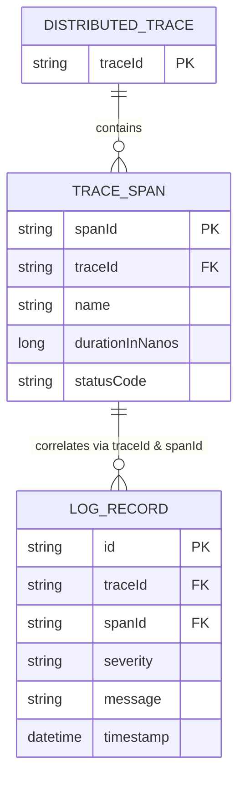

# Data Model: Active OpenTelemetry Logging and Tracing Telemetry

**Feature**: `020-active-telemetry-export`  
**Date**: 2026-09-18  

---

## 1. Entities & Data Models

### 1.1 Log Record Payload (`otel-logs` Index)
Captured from Logback via OpenTelemetry LogRecordBuilder and exported over OTLP HTTP:

| Attribute | Type | Description | Source |
|---|---|---|---|
| `timestamp` | Date (ISO-8601) | Timestamp of the log event | `ILoggingEvent.getTimeStamp()` |
| `serviceName` | Keyword | Name of the emitting microservice | `spring.application.name` |
| `severity` | Keyword | Severity level (`DEBUG`, `INFO`, `WARN`, `ERROR`) | `ILoggingEvent.getLevel()` |
| `logger` | Keyword / Text | Fully qualified logger name | `ILoggingEvent.getLoggerName()` |
| `thread` | Keyword | Thread name executing the operation | `ILoggingEvent.getThreadName()` |
| `message` | Text | Formatted log message (max 32KB; truncated with `[TRUNCATED]` if exceeded) | `ILoggingEvent.getFormattedMessage()` |
| `traceId` | Keyword (Optional) | Correlated 128-bit W3C Trace ID (32 hex characters) | MDC `traceId` |
| `spanId` | Keyword (Optional) | Correlated 64-bit W3C Span ID (16 hex characters) | MDC `spanId` |
| `exception` | Text (Optional) | Stack trace if error (max 64KB; truncated with `[TRUNCATED]` if exceeded) | `IThrowableProxy` |

### 1.2 Distributed Trace Span (`ss4o_traces-default-namespace` Data Stream)
Captured from Micrometer Tracing bridge and exported over OTLP HTTP:

| Attribute | Type | Description | Source |
|---|---|---|---|
| `traceId` | Keyword | 128-bit W3C Trace ID (32 hex characters) | `SpanContext.getTraceId()` |
| `spanId` | Keyword | 64-bit W3C Span ID (16 hex characters) | `SpanContext.getSpanId()` |
| `parentSpanId` | Keyword (Optional) | Parent operation Span ID | `Span.getParentSpanId()` |
| `name` | Keyword | Operation name (e.g. `GET /api/v1/restaurants`) | `Span.getName()` |
| `serviceName` | Keyword | Originating service name | `service.name` Resource attribute |
| `startTime` | Date | Start timestamp | `SpanData.getStartEpochNanos()` |
| `endTime` | Date | End timestamp | `SpanData.getEndEpochNanos()` |
| `durationInNanos`| Long | Operation duration in nanoseconds | `endTime - startTime` |
| `statusCode` | Keyword | Status outcome (`OK` / `UNSET` for 2xx/4xx, `ERROR` for 5xx) | `StatusCode` |
| `attributes` | Object | Standard OpenTelemetry semantic conventions | HTTP method, status code, route |

---

## 2. Relationships & Correlation

