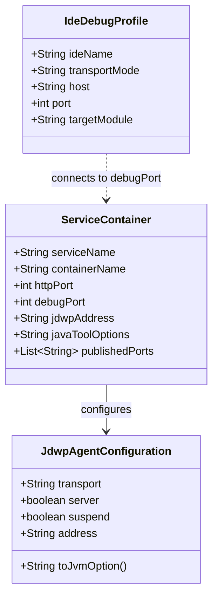
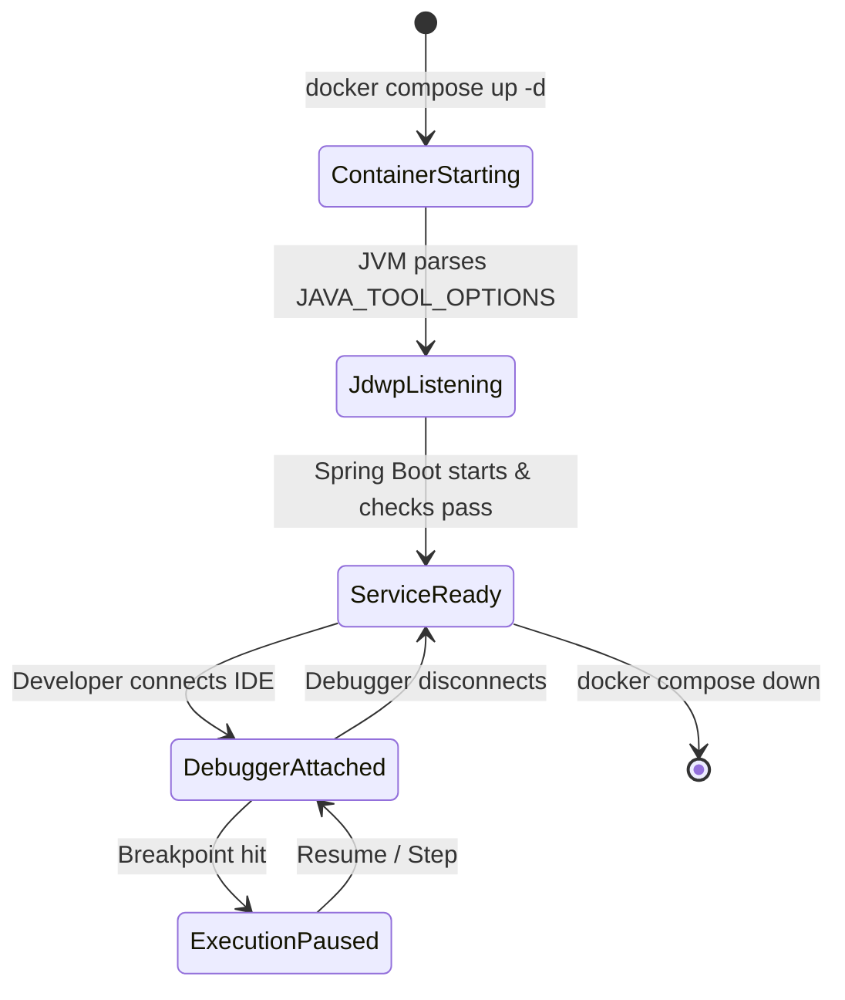

# Data Model & Configuration Schema: Local Remote Debugging

**Feature**: `021-remote-debugging`  
**Date**: 2026-09-19  
**Status**: Completed  

---

## 1. Entities & Configuration Structure

Although remote debugging is a developer-infrastructure configuration rather than a persistent database domain, it has clear structural entities, configuration attributes, validation rules, and lifecycle states.

---

## 2. Entity Definitions

### 2.1 `ServiceContainer`
Represents the containerized microservice running under Docker Compose.

- **`serviceName`** (`String`, Required): Name of the Compose service (e.g., `gateway`, `reservation-service`).
- **`containerName`** (`String`, Required): Container name assigned in Compose (e.g., `rube-gateway`, `rube-reservation-service`).
- **`httpPort`** (`Integer`, Required): Host and container HTTP listener port (`8080`, `8082`–`8088`).
- **`debugPort`** (`Integer`, Required): Host and container JDWP debug listener port (`5080`, `5082`–`5088`).
- **`jdwpAddress`** (`String`, Required): Interface and port binding string formatted as `*:<debugPort>` (e.g., `*:5080`).
- **`javaToolOptions`** (`String`, Required): Composite JVM options passed via environment:
  `-Xms128m -Xmx384m -agentlib:jdwp=transport=dt_socket,server=y,suspend=n,address=*:<debugPort>`
- **`publishedPorts`** (`List<String>`, Required): Array of published port mappings in Docker Compose:
  - `"<httpPort>:<httpPort>"`
  - `"<debugPort>:<debugPort>"`

### 2.2 `JdwpAgentConfiguration`
Represents the parameters of the Java Debug Wire Protocol agent library.

- **`transport`** (`String`, Constant): `dt_socket` (TCP socket transport).
- **`server`** (`Boolean`, Constant): `y` (runs as a socket server waiting for incoming debugger connections).
- **`suspend`** (`Boolean`, Constant): `n` (does not pause JVM startup; boots immediately).
- **`address`** (`String`, Required): Target interface and port (`*:<debugPort>`).

### 2.3 `IdeDebugProfile`
Represents a developer's local IDE debugger run configuration.

- **`ideName`** (`String`, Enum): `IntelliJ IDEA`, `Visual Studio Code`, `Eclipse`.
- **`transportMode`** (`String`, Constant): `Socket` / `dt_socket`.
- **`host`** (`String`, Constant): `localhost` (or `127.0.0.1`).
- **`port`** (`Integer`, Required): Dedicated service debug port (`5080`, `5082`–`5088`).
- **`targetModule`** (`String`, Required): Maven submodule providing the source code and symbols for breakpoints.

---

## 3. Port Matrix & Validation Rules

### Port Allocation Matrix

| Service | Container Name | HTTP Port | Debug Port (Host & Container) | Memory Options | Full `JAVA_TOOL_OPTIONS` |
|---|---|---|---|---|---|
| `gateway` | `rube-gateway` | `8080` | `5080` | `-Xms128m -Xmx384m` | `-Xms128m -Xmx384m -agentlib:jdwp=transport=dt_socket,server=y,suspend=n,address=*:5080` |
| `customer-service` | `rube-customer-service` | `8082` | `5082` | `-Xms128m -Xmx384m` | `-Xms128m -Xmx384m -agentlib:jdwp=transport=dt_socket,server=y,suspend=n,address=*:5082` |
| `restaurant-service` | `rube-restaurant-service` | `8083` | `5083` | `-Xms128m -Xmx384m` | `-Xms128m -Xmx384m -agentlib:jdwp=transport=dt_socket,server=y,suspend=n,address=*:5083` |
| `availability-service` | `rube-availability-service` | `8084` | `5084` | `-Xms128m -Xmx384m` | `-Xms128m -Xmx384m -agentlib:jdwp=transport=dt_socket,server=y,suspend=n,address=*:5084` |
| `reservation-service` | `rube-reservation-service` | `8085` | `5085` | `-Xms128m -Xmx384m` | `-Xms128m -Xmx384m -agentlib:jdwp=transport=dt_socket,server=y,suspend=n,address=*:5085` |
| `waiting-list-service` | `rube-waiting-list-service` | `8086` | `5086` | `-Xms128m -Xmx384m` | `-Xms128m -Xmx384m -agentlib:jdwp=transport=dt_socket,server=y,suspend=n,address=*:5086` |
| `analytics-service` | `rube-analytics-service` | `8087` | `5087` | `-Xms128m -Xmx384m` | `-Xms128m -Xmx384m -agentlib:jdwp=transport=dt_socket,server=y,suspend=n,address=*:5087` |
| `notification-service` | `rube-notification-service` | `8088` | `5088` | `-Xms128m -Xmx384m` | `-Xms128m -Xmx384m -agentlib:jdwp=transport=dt_socket,server=y,suspend=n,address=*:5088` |

### Validation Rules
1. **Uniqueness**: All debug ports must be mutually unique within the host network.
2. **Symmetry**: For any service $S$, `HostPort(S) == ContainerPort(S) == 5000 + (HttpPort(S) % 1000)`.
3. **No Collision with Shared Infrastructure**:
   - `5080`–`5088` $\cap$ `{1025, 4317, 4318, 5432, 5601, 6379, 8025, 8081, 9092, 9200, 29092}` $= \emptyset$.
4. **Interface Binding**: The JDWP address host component MUST be `*` (not `127.0.0.1` or omitted) to permit ingress through Docker container bridge networking.
5. **Non-Blocking Execution**: `suspend=n` is mandatory across all services.

---

## 4. Lifecycle & State Transitions

- **ContainerStarting → JdwpListening**: OpenJDK outputs `Picked up JAVA_TOOL_OPTIONS: ...` and immediately binds a TCP socket server on port `508x`.
- **JdwpListening → ServiceReady**: Because `suspend=n`, main thread execution proceeds directly to Spring Boot application bootstrap.
- **DebuggerAttached / ExecutionPaused**: When an IDE attaches, only intercepted threads pause; health probes and other services continue functioning normally.
- **Debugger Detachment**: Disconnecting the debugger releases any attached handles without restarting or crashing the JVM.
